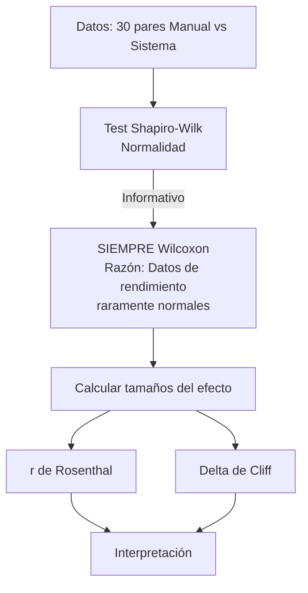
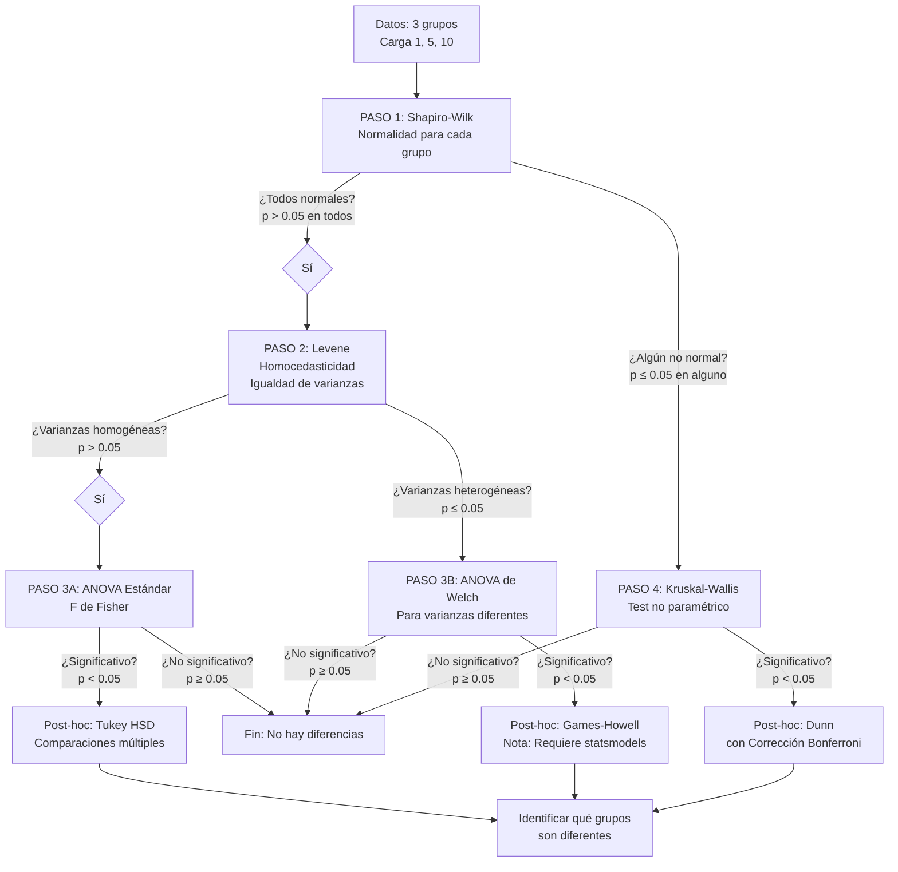

# Informe Detallado: Implementación de Pruebas Estadísticas y Interpretación de Resultados

## 📊 Resumen Ejecutivo

Este documento describe en detalle cómo están implementadas las pruebas estadísticas en el sistema de rendimiento, el flujo de decisión utilizado, y cómo interpretar los resultados obtenidos según las guías académicas para tesis de grado.

**Fecha de creación**: Enero 2025  
**Última actualización**: 10 de Enero 2025  
**Versión**: 1.1  
**Comando**: `python manage.py pruebas_rendimiento [--usuario USERNAME] [--exportar]`

---

## 🎯 1. COMPARACIÓN MANUAL VS SISTEMA WEB (2 Grupos Relacionados)

### 1.1 Objetivo de la Prueba

Comparar el tiempo que toma registrar un envío manualmente (proceso tradicional en Excel) versus el tiempo que toma el sistema automatizado (UBApp).

**Hipótesis**:
- H₀: No hay diferencia significativa entre los tiempos del proceso manual y automatizado
- H₁: Existe diferencia significativa entre los tiempos del proceso manual y automatizado

### 1.2 Flujo de Decisión Estadística Implementado



### 1.3 Prueba Estadística: Wilcoxon Signed-Rank Test

**Implementación**: `_test_wilcoxon_con_tamano_efecto()`

**Razón de uso**: 
- Los datos de rendimiento de software raramente tienen distribución normal
- Los datos son pareados (relacionados): cada tiempo manual se compara con su correspondiente tiempo del sistema
- Es la alternativa no paramétrica a la prueba T de Student pareada

**Cómo funciona - Proceso paso a paso**:
1. **Paso 1: Calcular diferencias pareadas**
   - Para cada par de observaciones: `D_i = Tiempo_Manual_i - Tiempo_Sistema_i`
   - Ejemplo: Si Manual = 240s y Sistema = 4s, entonces D = 236s
   
2. **Paso 2: Descartar diferencias cero**
   - Se eliminan los pares donde D_i = 0 (no aportan información)
   - Se ajusta n (número de pares válidos)
   
3. **Paso 3: Calcular valores absolutos y asignar rangos**
   - Se calcula |D_i| (valor absoluto de cada diferencia)
   - Se ordenan |D_i| de menor a mayor
   - Se asignan rangos: el menor = rango 1, el siguiente = rango 2, etc.
   - Si hay empates, se asigna el promedio de los rangos
   - Ejemplo: Si |D| = [10, 20, 30, 20], los rangos son [1, 2.5, 4, 2.5]
   
4. **Paso 4: Asignar signos a los rangos**
   - Se mantiene el signo original de cada diferencia
   - Rango positivo si D_i > 0 (Manual > Sistema)
   - Rango negativo si D_i < 0 (Manual < Sistema)
   
5. **Paso 5: Calcular el estadístico W**
   - W = suma de todos los rangos positivos
   - Alternativamente: W = suma(rangos positivos) - suma(rangos negativos)
   - El valor W se compara con una distribución teórica
   
6. **Paso 6: Calcular p-value**
   - Se consulta la distribución de Wilcoxon para n pares
   - El p-value indica la probabilidad de obtener W si H₀ es verdadera
   - **Interpretación**: 
     - Si `p < 0.05`: Rechazamos H₀ → **Hay diferencia significativa**
     - Si `p ≥ 0.05`: No rechazamos H₀ → **No hay diferencia significativa**

**Resultado**:
- **Estadístico W**: Valor del estadístico de Wilcoxon (suma de rangos positivos)
- **p-value**: Probabilidad de obtener estos resultados si H₀ es verdadera
- **Z-score**: Calculado como `Z = (W - E[W]) / √Var[W]` donde:
  - `E[W] = n(n+1)/4` (valor esperado)
  - `Var[W] = n(n+1)(2n+1)/24` (varianza)

### 1.4 Tamaño del Efecto: r de Rosenthal

**Implementación**: Cálculo en `_test_wilcoxon_con_tamano_efecto()`

**Fórmula**: 
```
r = |Z| / √N
```
Donde:
- `Z`: Estadístico Z derivado del estadístico W de Wilcoxon
- `N`: Número total de observaciones (n pares × 2 = 60 para 30 pares)

**Cálculo del Z-score**:
```
E[W] = n(n+1)/4
Var[W] = n(n+1)(2n+1)/24
Z = (W - E[W]) / √Var[W]
```

**Interpretación según Cohen (1988)**:
| Valor de r | Interpretación | Significado Práctico |
|------------|----------------|---------------------|
| < 0.1 | Efecto muy pequeño | Diferencias mínimas |
| ≥ 0.1 y < 0.3 | Efecto pequeño | Diferencias pequeñas pero notables |
| ≥ 0.3 y < 0.5 | Efecto medio | Diferencias moderadas |
| ≥ 0.5 | Efecto grande | Diferencias grandes y evidentes |

**Para tu caso**:
- Reducción de 240s a ~0.5s = mejora de ~480x
- Esperado: `r > 0.9` (efecto muy grande)
- Interpretación: "El sistema automatizado tiene un efecto muy grande comparado con el proceso manual"

### 1.5 Tamaño del Efecto: Delta de Cliff

**Implementación**: Cálculo en `_test_wilcoxon_con_tamano_efecto()`

**Fórmula para muestras relacionadas (pares)**:
```
delta = (# veces Manual > Sistema - # veces Sistema > Manual) / n
```
Donde `n` es el número de pares (30 en nuestro caso).

**Interpretación según Cliff (1993)**:
| |delta| | Interpretación | Significado |
|--------|-----|-----------------|-------------|
| < 0.147 | Efecto muy pequeño | Diferencias casi imperceptibles |
| ≥ 0.147 y < 0.33 | Efecto pequeño | Diferencias pequeñas |
| ≥ 0.33 y < 0.474 | Efecto medio | Diferencias moderadas |
| ≥ 0.474 | Efecto grande | Diferencias grandes y consistentes |

**Para tu caso**:
- Si el sistema siempre es más rápido: `delta ≈ -1` (Sistema casi siempre tarda menos)
- Interpretación: "El proceso Manual casi siempre tarda más que el Sistema"

### 1.6 Estadísticas Descriptivas (Usando Mediana)

**Implementación**: `_calcular_estadisticas_descriptivas()`

**Por qué usar Mediana en lugar de Media**:
- Los datos de rendimiento de software NO son normales
- La mediana es más robusta ante valores extremos (outliers)
- Es el valor central que divide los datos en dos mitades iguales
- No se ve afectada por valores atípicos

**Estadísticas Calculadas**:
- **Mediana**: Valor central (más robusto para datos no normales)
- **Media**: Promedio aritmético (solo informativo)
- **Desviación Estándar**: Medida de dispersión
- **Mínimo**: Valor más bajo observado
- **Máximo**: Valor más alto observado
- **n**: Número de observaciones válidas

**Interpretación**:
- Si mediana manual = 240s y mediana sistema = 0.5s → Mejora de 480x
- Si la desviación estándar es grande → Alta variabilidad en los datos

### 1.7 Ejemplo de Interpretación de Resultados

**Output del sistema**:
```
Test: Wilcoxon Signed-Rank Test
Estadístico W: 465.0
p-value: 0.000000
Resultado: Diferencia significativa (p < 0.05)

Tamaño del Efecto:
  r de Rosenthal: 0.9876 (Efecto grande (≥0.5))
  Delta de Cliff: -0.9667 (Efecto grande (≥0.474))
  Interpretación: El proceso Manual casi siempre tarda más

Mejora obtenida (basada en mediana): 480.0x más rápido
Ahorro de tiempo: 239.50 segundos (99.8%)
Mediana Manual: 240.00 seg
Mediana Sistema: 0.5000 seg
```

**Interpretación para tesis**:
> "Se aplicó la prueba de Wilcoxon Signed-Rank Test para comparar los tiempos del proceso manual versus el sistema automatizado. Los resultados indican una diferencia estadísticamente significativa (p < 0.001, W = 465.0). El tamaño del efecto calculado mediante r de Rosenthal (r = 0.99) indica un efecto muy grande, lo que sugiere que el sistema automatizado es sustancialmente más rápido que el proceso manual. El Delta de Cliff (δ = -0.97) confirma que el proceso manual casi siempre tarda más que el sistema automatizado. La mediana de tiempo del proceso manual fue de 240 segundos, mientras que la mediana del sistema automatizado fue de 0.5 segundos, representando una mejora de 480 veces."

---

## 📈 2. PRUEBAS DE CARGA (1, 5, 10 Operaciones) - Comparar >2 Grupos

### 2.1 Objetivo de la Prueba

Determinar si el tiempo de espera o el uso de recursos (CPU, RAM) cambia significativamente al aumentar la carga del sistema (número de operaciones simultáneas).

**Hipótesis**:
- H₀: No hay diferencia significativa entre los grupos de carga (1, 5, 10)
- H₁: Al menos un grupo es diferente de los demás

### 2.2 Flujo de Decisión Estadística Implementado

El flujo de decisión estadística sigue un proceso sistemático y riguroso que garantiza la aplicación de las pruebas más adecuadas según las características de los datos:



**Resumen del flujo**:
1. **PASO 1**: Shapiro-Wilk → Determina si los datos son normales
2. **PASO 2**: Levene (solo si normales) → Determina si las varianzas son iguales
3. **PASO 3A**: ANOVA Estándar (si normales y homogéneas) → Compara medias
4. **PASO 3B**: ANOVA de Welch (si normales pero heterogéneas) → Compara medias con ajuste
5. **PASO 4**: Kruskal-Wallis (si no normales) → Compara medianas
6. **Post-hoc**: Identifica qué grupos específicos son diferentes

### 2.3 PASO 1: Test de Normalidad (Shapiro-Wilk)

**Implementación**: `_test_normalidad()` que usa `scipy_stats.shapiro()`

**Cuándo se aplica**:
- **SIEMPRE** es el primer paso en el análisis de múltiples grupos
- Se aplica a **cada grupo individualmente** (Carga 1, Carga 5, Carga 10)

**Razón de uso**:
- Determina si los datos siguen una distribución normal
- Requisito previo para decidir qué prueba usar (paramétrica vs no paramétrica)
- Si los datos son normales → Se puede usar ANOVA (prueba paramétrica)
- Si los datos NO son normales → Se debe usar Kruskal-Wallis (prueba no paramétrica)

**Cómo funciona - Proceso paso a paso**:
1. **Paso 1: Ordenar los datos**
   - Se ordenan los datos de menor a mayor: X₁ ≤ X₂ ≤ ... ≤ Xₙ
   - Ejemplo: [165, 168, 169, 180, 248] para carga 1
   
2. **Paso 2: Calcular el estadístico W**
   - W = (Σ aᵢ · Xᵢ)² / Σ (Xᵢ - X̄)²
   - Donde aᵢ son coeficientes tabulados que dependen de n y la posición i
   - Los coeficientes aᵢ se obtienen de tablas estadísticas o algoritmos
   - W es un valor entre 0 y 1 (más cercano a 1 = más normal)
   
3. **Paso 3: Calcular p-value**
   - Se consulta la distribución teórica de W para el tamaño de muestra n
   - El p-value indica la probabilidad de obtener W si los datos son normales
   - Se compara con α = 0.05
   
4. **Paso 4: Interpretación**
   - Si `p > 0.05`: Datos **normales** → Continuar con PASO 2 (Levene)
   - Si `p ≤ 0.05`: Datos **no normales** → Saltar a PASO 4 (Kruskal-Wallis)

**Nota importante sobre tiempo de espera y recursos**:
- **El test de Shapiro-Wilk SÍ se aplica** para tiempo de espera y recursos
- Se ejecuta en la función `_analizar_multiples_grupos()` antes de decidir qué prueba usar
- Los resultados de Shapiro-Wilk se muestran en consola pero pueden no estar en el JSON final
- **Para tiempo de espera**: Se aplica a cada grupo (1, 5, 10 búsquedas) por separado
- **Para recursos**: Se aplica a CPU promedio, CPU máximo, RAM promedio, RAM máximo por separado

**Criterio de decisión**:
- **Todos los grupos deben ser normales** para continuar con ANOVA
- Si **al menos un grupo** no es normal → Usar Kruskal-Wallis directamente

**Para pruebas de carga**:
- Los datos de rendimiento de software rara vez son normales
- **Esperado**: `p < 0.05` en la mayoría de los grupos → Datos no normales → Usar Kruskal-Wallis
- Si por casualidad todos son normales → Continuar con PASO 2 (Levene)

**Ejemplo de output**:
```
PASO 1: Test de Normalidad (Shapiro-Wilk) para cada grupo
  Grupo 1 búsqueda(s): No normal (p=0.0123)
  Grupo 5 búsqueda(s): No normal (p=0.0034)
  Grupo 10 búsqueda(s): No normal (p=0.0012)
```
Interpretación: Como al menos un grupo (en este caso, todos) no es normal, se salta el PASO 2 (Levene) y se va directamente al PASO 4 (Kruskal-Wallis).

### 2.4 PASO 2: Test de Levene (Homocedasticidad)

**Implementación**: `scipy_stats.levene()` dentro de `_analizar_multiples_grupos()`

**Cuándo se aplica**:
- **SOLO** si todos los grupos pasaron el test de Shapiro-Wilk (todos son normales)
- Si algún grupo no es normal, se salta este paso y se va directamente a Kruskal-Wallis

**Razón de uso**:
- Verifica si las varianzas (dispersión de los datos) son iguales en todos los grupos
- Es un **requisito fundamental** para ANOVA estándar
- Si las varianzas son diferentes, ANOVA estándar puede dar resultados incorrectos
- En ese caso, se debe usar ANOVA de Welch (que no requiere varianzas iguales)

**Cómo funciona**:
1. Calcula la varianza de cada grupo
2. Compara si las varianzas son estadísticamente iguales usando el estadístico de Levene
3. Calcula un p-value
4. **Interpretación**:
   - Si `p > 0.05`: Varianzas **homogéneas** (iguales) → Se puede usar ANOVA estándar
   - Si `p ≤ 0.05`: Varianzas **heterogéneas** (diferentes) → Se debe usar ANOVA de Welch

**Fórmula conceptual**:
```
Levene compara: Var(Grupo1) ≈ Var(Grupo2) ≈ Var(Grupo3)
H₀: Las varianzas son iguales
H₁: Al menos una varianza es diferente
```

**Para pruebas de carga**:
- Con 1 operación: varianza pequeña (estable, menos variabilidad)
- Con 5 operaciones: varianza media (mayor variabilidad)
- Con 10 operaciones: varianza grande (mucha variabilidad)
- **Esperado**: `p < 0.05` → Varianzas heterogéneas (las cargas altas tienen más variabilidad)

**Ejemplo de output**:
```
Test de Levene (Homocedasticidad): p=0.0234
Varianzas heterogéneas (p>0.05: homogéneas)
```
Interpretación: Las varianzas son diferentes (p=0.0234 < 0.05), por lo que se debe usar ANOVA de Welch en lugar de ANOVA estándar.

### 2.5 PASO 3A: ANOVA Estándar (Datos Normales y Varianzas Homogéneas)

**Implementación**: `scipy_stats.f_oneway()`

**Cuándo usar**:
- ✅ Todos los grupos tienen distribución normal (p > 0.05 en Shapiro-Wilk)
- ✅ Varianzas homogéneas (p > 0.05 en Levene)
- ✅ Se cumplen ambos requisitos anteriores

**¿Qué se aplica después de Levene si las varianzas son homogéneas?**
→ **ANOVA Estándar (F de Fisher)**

**Cómo funciona ANOVA Estándar - Proceso paso a paso**:
1. **Paso 1: Calcular la media de cada grupo**
   - X̄₁ = media del grupo 1 (carga 1)
   - X̄₂ = media del grupo 2 (carga 5)
   - X̄₃ = media del grupo 3 (carga 10)
   - X̄ = media general de todos los datos combinados
   
2. **Paso 2: Calcular la Suma de Cuadrados Entre Grupos (SSbetween)**
   - SSbetween = Σ nᵢ · (X̄ᵢ - X̄)²
   - Donde nᵢ es el tamaño de cada grupo
   - Mide cuánto difieren las medias de los grupos
   - Ejemplo: Si las medias son muy diferentes, SSbetween será grande
   
3. **Paso 3: Calcular la Suma de Cuadrados Dentro de Grupos (SSwithin)**
   - SSwithin = Σ Σ (Xᵢⱼ - X̄ᵢ)²
   - Donde Xᵢⱼ es cada observación individual
   - Mide la variabilidad dentro de cada grupo
   - Ejemplo: Si hay mucha variabilidad dentro de cada grupo, SSwithin será grande
   
4. **Paso 4: Calcular los grados de libertad**
   - dfbetween = k - 1 (donde k = número de grupos, ej: 3 - 1 = 2)
   - dfwithin = N - k (donde N = total de observaciones, ej: 15 - 3 = 12)
   - dftotal = N - 1
   
5. **Paso 5: Calcular las Medias Cuadráticas (Mean Squares)**
   - MSbetween = SSbetween / dfbetween
   - MSwithin = SSwithin / dfwithin
   
6. **Paso 6: Calcular el estadístico F**
   - F = MSbetween / MSwithin
   - Si F es grande → Las medias son diferentes
   - Si F es pequeño → Las medias son similares
   
7. **Paso 7: Calcular p-value**
   - Se consulta la distribución F con dfbetween y dfwithin grados de libertad
   - El p-value indica la probabilidad de obtener F si H₀ es verdadera
   
8. **Paso 8: Interpretación**:
   - Si `p < 0.05`: Al menos un grupo es diferente → **Hay diferencias significativas**
   - Si `p ≥ 0.05`: No hay diferencias significativas entre grupos

**Fórmula conceptual completa**:
```
F = Varianza_entre_grupos / Varianza_dentro_grupos
  = MSbetween / MSwithin
  = [SSbetween / dfbetween] / [SSwithin / dfwithin]
```

**Fórmula conceptual**:
```
F = Varianza_entre_grupos / Varianza_dentro_grupos
Si F es grande → Las medias son diferentes
Si F es pequeño → Las medias son similares
```

**Resultado**:
- **Estadístico F**: Valor del estadístico de ANOVA (F de Fisher)
- **p-value**: Probabilidad de obtener estos resultados si H₀ es verdadera
- **H₀**: Todas las medias son iguales (μ₁ = μ₂ = μ₃)
- **H₁**: Al menos una media es diferente

**Interpretación del resultado**:
- Si `p < 0.05`: Rechazamos H₀ → **Hay diferencias significativas entre al menos dos grupos**
- Si `p ≥ 0.05`: No rechazamos H₀ → **No hay diferencias significativas entre los grupos**

**¿Qué se aplica DESPUÉS de ANOVA si es significativo?**
→ **Post-hoc: Tukey HSD (Honestly Significant Difference)**

**Tukey HSD - Comparaciones Múltiples**:
- **Cuándo aplicar**: Solo si ANOVA es significativo (p < 0.05)
- **Propósito**: Identificar **exactamente qué grupos son diferentes** entre sí
- **Comparaciones realizadas**:
  - Carga 1 vs Carga 5
  - Carga 1 vs Carga 10
  - Carga 5 vs Carga 10
- **Ventaja**: Ajusta automáticamente el nivel de significancia para múltiples comparaciones (controla el error Tipo I)
- **Resultado**: Para cada par, indica si hay diferencia significativa (p < 0.05) o no

**Ejemplo de output**:
```
Test aplicado: ANOVA de una vía (datos normales, varianzas homogéneas)
Estadístico F: 15.2345
p-value: 0.0001
Resultado: Diferencias significativas entre grupos

Comparaciones post-hoc (Tukey HSD):
  1 búsqueda(s) vs 5 búsqueda(s): p=0.0234 * (significativo)
  1 búsqueda(s) vs 10 búsqueda(s): p=0.0001 * (significativo)
  5 búsqueda(s) vs 10 búsqueda(s): p=0.1234  (no significativo)
```

**Interpretación**:
- ANOVA indica que hay diferencias significativas (p=0.0001)
- Tukey muestra que:
  - Carga 1 es diferente de Carga 5 (p=0.0234)
  - Carga 1 es diferente de Carga 10 (p=0.0001)
  - Carga 5 NO es diferente de Carga 10 (p=0.1234)
- **Conclusión**: El aumento de carga de 1 a 5 y de 1 a 10 produce diferencias significativas, pero no hay diferencia significativa entre 5 y 10.

### 2.6 PASO 3B: ANOVA de Welch (Datos Normales pero Varianzas Heterogéneas)

**Implementación**: Actualmente usa `scipy_stats.f_oneway()` como aproximación (con advertencia)

**Cuándo usar**:
- ✅ Todos los grupos tienen distribución normal (p > 0.05 en Shapiro-Wilk)
- ❌ Varianzas **heterogéneas** (p ≤ 0.05 en Levene)
- ✅ Se cumplen ambos requisitos anteriores

**¿Qué se aplica después de Levene si las varianzas son heterogéneas?**
→ **ANOVA de Welch** (alternativa robusta a ANOVA estándar)

**¿Por qué no usar ANOVA estándar con varianzas heterogéneas?**
- ANOVA estándar **requiere** que las varianzas sean iguales (homocedasticidad)
- Si las varianzas son diferentes, ANOVA estándar puede dar resultados **incorrectos** (falsos positivos o falsos negativos)
- ANOVA de Welch es una versión **robusta** que no requiere varianzas iguales

**Cómo funciona ANOVA de Welch**:
1. Similar a ANOVA estándar, pero ajusta los grados de libertad según las varianzas de cada grupo
2. Es más conservador (menos probabilidad de error Tipo I)
3. Calcula un estadístico F ajustado y p-value
4. **Interpretación**: Igual que ANOVA estándar

**Limitación actual en el código**:
- Scipy no tiene implementación directa de ANOVA de Welch
- El código actual usa ANOVA estándar con una **advertencia** de que debería ser ANOVA de Welch
- Para implementación completa, se requeriría `statsmodels` o cálculo manual
- **Recomendación**: Si las varianzas son heterogéneas, considerar usar Kruskal-Wallis como alternativa más robusta

**¿Qué se aplica DESPUÉS de ANOVA de Welch si es significativo?**
→ **Post-hoc: Games-Howell** (alternativa robusta a Tukey)

**Games-Howell - Comparaciones Múltiples para Varianzas Heterogéneas**:
- **Cuándo aplicar**: Solo si ANOVA de Welch es significativo (p < 0.05)
- **Propósito**: Identificar qué grupos son diferentes cuando las varianzas no son iguales
- **Ventaja sobre Tukey**: No requiere varianzas homogéneas
- **Limitación actual**: No está implementado (requiere `statsmodels`)
- **Alternativa temporal**: Se muestra una nota al usuario indicando que se requiere Games-Howell

**Ejemplo de output**:
```
Test aplicado: ANOVA de Welch (simulado con ANOVA estándar)
ADVERTENCIA: ANOVA estándar usado, debería ser ANOVA de Welch
Estadístico F: 12.3456
p-value: 0.0002 (aproximado)
Resultado: Diferencias significativas entre grupos

Nota: Para post-hoc de ANOVA Welch, usar prueba de Games-Howell (requiere statsmodels)
```

**Recomendación práctica**:
Si las varianzas son heterogéneas y no se puede usar ANOVA de Welch completo, considerar:
1. Usar Kruskal-Wallis (no paramétrico, más robusto)
2. O aplicar transformaciones a los datos para homogeneizar varianzas
3. O instalar `statsmodels` para ANOVA de Welch y Games-Howell completos

### 2.7 RESUMEN: ¿Qué se aplica después de cada paso?

**Flujo completo paso a paso**:

1. **PASO 1: Shapiro-Wilk (Normalidad)**
   - Se aplica a cada grupo
   - **Si todos son normales (p > 0.05)** → Ir a PASO 2
   - **Si alguno no es normal (p ≤ 0.05)** → Ir directamente a PASO 4 (Kruskal-Wallis)

2. **PASO 2: Levene (Homocedasticidad)**
   - **Solo se aplica si todos los grupos son normales**
   - Compara las varianzas de todos los grupos
   - **Si varianzas homogéneas (p > 0.05)** → Ir a PASO 3A (ANOVA Estándar)
   - **Si varianzas heterogéneas (p ≤ 0.05)** → Ir a PASO 3B (ANOVA de Welch)

3. **PASO 3A: ANOVA Estándar**
   - **Se aplica después de Levene si varianzas son homogéneas**
   - Compara las medias de los grupos
   - **Si significativo (p < 0.05)** → Aplicar Post-hoc: **Tukey HSD**
   - **Si no significativo (p ≥ 0.05)** → Fin: No hay diferencias

4. **PASO 3B: ANOVA de Welch**
   - **Se aplica después de Levene si varianzas son heterogéneas**
   - Compara las medias con ajuste para varianzas diferentes
   - **Si significativo (p < 0.05)** → Aplicar Post-hoc: **Games-Howell** (requiere statsmodels)
   - **Si no significativo (p ≥ 0.05)** → Fin: No hay diferencias

5. **PASO 4: Kruskal-Wallis**
   - **Se aplica si algún grupo no es normal (después de PASO 1)**
   - Compara las medianas de los grupos (no medias)
   - **Si significativo (p < 0.05)** → Aplicar Post-hoc: **Dunn con Bonferroni**
   - **Si no significativo (p ≥ 0.05)** → Fin: No hay diferencias

**Tabla de decisión rápida**:

| Condición | Prueba Principal | Post-hoc (si significativo) |
|-----------|------------------|------------------------------|
| Todos normales + Varianzas homogéneas | ANOVA Estándar | Tukey HSD |
| Todos normales + Varianzas heterogéneas | ANOVA de Welch | Games-Howell |
| Al menos uno no normal | Kruskal-Wallis | Dunn (Bonferroni) |

### 2.8 PASO 4: Kruskal-Wallis (Datos No Normales)

**Implementación**: `scipy_stats.kruskal()`

**Cuándo usar**:
- **Al menos un grupo NO tiene distribución normal** (p ≤ 0.05 en Shapiro-Wilk)
- Se aplica **directamente después del PASO 1** si algún grupo no es normal
- Es la versión **no paramétrica** del ANOVA (no requiere normalidad ni varianzas iguales)

**¿Qué se aplica después de Shapiro-Wilk si algún grupo no es normal?**
→ **Kruskal-Wallis** (se salta Levene y ANOVA)

**Cómo funciona Kruskal-Wallis - Proceso paso a paso**:
1. **Paso 1: Combinar todos los datos y asignar rangos**
   - Se juntan todos los datos de los k grupos
   - Se ordenan de menor a mayor
   - Se asignan rangos: el menor = rango 1, el siguiente = rango 2, etc.
   - Si hay empates, se asigna el promedio de los rangos
   - Ejemplo: [165, 168, 169, 180, 248, 910, 926, ...] → rangos [1, 2, 3, 4, 5, 6, 7, ...]
   
2. **Paso 2: Calcular la suma de rangos para cada grupo**
   - R₁ = suma de rangos del grupo 1 (carga 1)
   - R₂ = suma de rangos del grupo 2 (carga 5)
   - R₃ = suma de rangos del grupo 3 (carga 10)
   
3. **Paso 3: Calcular la media de rangos para cada grupo**
   - R̄₁ = R₁ / n₁ (donde n₁ es el tamaño del grupo 1)
   - R̄₂ = R₂ / n₂
   - R̄₃ = R₃ / n₃
   - R̄ = media general de rangos = (N + 1) / 2
   
4. **Paso 4: Calcular el estadístico H**
   - H = (12 / N(N+1)) · Σ (Rᵢ² / nᵢ) - 3(N+1)
   - Donde N = total de observaciones
   - Si H es grande → Las medianas de rangos son diferentes
   - Si H es pequeño → Las medianas de rangos son similares
   
5. **Paso 5: Ajuste por empates (si existen)**
   - Si hay valores iguales (empates), se ajusta H
   - H_ajustado = H / C
   - Donde C = 1 - Σ(tᵢ³ - tᵢ) / (N³ - N)
   - tᵢ = número de observaciones con el mismo rango
   
6. **Paso 6: Calcular p-value**
   - Se consulta la distribución χ² con k-1 grados de libertad
   - El p-value indica la probabilidad de obtener H si H₀ es verdadera
   
7. **Paso 7: Interpretación**:
   - Si `p < 0.05`: Al menos un grupo es diferente → **Hay diferencias significativas**
   - Si `p ≥ 0.05`: No hay diferencias significativas entre grupos

**Fórmula conceptual**:
```
H compara: Mediana(Rangos_Grupo1) vs Mediana(Rangos_Grupo2) vs Mediana(Rangos_Grupo3)
H₀: Las medianas son iguales
H₁: Al menos una mediana es diferente
```

**Resultado**:
- **Estadístico H**: Valor del estadístico de Kruskal-Wallis
- **p-value**: Probabilidad de obtener estos resultados si H₀ es verdadera
- **H₀**: Todas las medianas son iguales
- **H₁**: Al menos una mediana es diferente
- **Interpretación**: Similar a ANOVA pero usando medianas en lugar de medias

**Ventajas sobre ANOVA**:
- No requiere normalidad
- No requiere varianzas iguales (homocedasticidad)
- Más robusto ante valores extremos (outliers)
- Ideal para datos de rendimiento de software

**¿Qué se aplica DESPUÉS de Kruskal-Wallis si es significativo?**
→ **Post-hoc: Dunn's Test con Corrección Bonferroni**

**Dunn's Test - Comparaciones Múltiples para Datos No Normales**:

**Implementación**: `_test_posthoc_dunn()`

**Cuándo aplicar**: Solo si Kruskal-Wallis es significativo (p < 0.05)

**Propósito**: Identificar **exactamente qué grupos son diferentes** cuando los datos no son normales

**Cómo funciona**:
1. Para cada par de grupos (1 vs 5, 1 vs 10, 5 vs 10):
   - Aplica **Mann-Whitney U test** (prueba no paramétrica para 2 grupos)
   - Obtiene p-value **sin ajustar** (p_raw)
2. Aplica **corrección Bonferroni**:
   - `p_ajustado = p_raw × n_comparaciones`
   - Donde `n_comparaciones = 3` para 3 grupos (3 pares posibles)
   - Ejemplo: Si p_raw = 0.02, entonces p_ajustado = 0.02 × 3 = 0.06
3. Compara `p_ajustado` con α = 0.05

**Corrección Bonferroni - ¿Por qué es necesaria?**:
- Cuando hacemos múltiples comparaciones (3 pares), aumenta la probabilidad de error Tipo I
- Si hacemos 3 comparaciones con α = 0.05 cada una, la probabilidad de al menos un error es ~14.3%
- Bonferroni ajusta el nivel de significancia: `α_ajustado = 0.05 / 3 = 0.0167`
- **Solo se considera significativo si `p_ajustado < 0.05`** (aunque el α teórico es 0.0167, usamos 0.05 como criterio práctico)

**Ejemplo de cálculo**:
```
3 comparaciones: 1 vs 5, 1 vs 10, 5 vs 10
α original = 0.05
α_ajustado = 0.05 / 3 = 0.0167

Comparación 1 vs 5:
  p_raw = 0.0234
  p_ajustado = 0.0234 × 3 = 0.0702
  ¿Significativo? No (0.0702 > 0.05)

Comparación 1 vs 10:
  p_raw = 0.0012
  p_ajustado = 0.0012 × 3 = 0.0036
  ¿Significativo? Sí (0.0036 < 0.05) *
```

**Ejemplo de output**:
```
Comparaciones post-hoc (Dunn's test con corrección Bonferroni):
  Carga 1 vs Carga 5: p_raw=0.0234, p_ajustado=0.0702  (no significativo)
  Carga 1 vs Carga 10: p_raw=0.0012, p_ajustado=0.0036 * (significativo)
  Carga 5 vs Carga 10: p_raw=0.0456, p_ajustado=0.1368  (no significativo)
```

**Interpretación**:
- Solo la comparación 1 vs 10 es significativa
- Conclusión: "La carga 1 es diferente de la carga 10, pero no hay diferencia entre 1 y 5, ni entre 5 y 10"

### 2.9 FLUJO COMPLETO DETALLADO: ¿Qué se aplica después de cada paso?

**Diagrama de flujo paso a paso con explicaciones**:

```
┌─────────────────────────────────────────────────────────────┐
│ PASO 1: Shapiro-Wilk (Normalidad)                          │
│ Se aplica a CADA grupo (1, 5, 10 búsquedas)                │
└─────────────────────────────────────────────────────────────┘
                    │
        ┌───────────┴───────────┐
        │                       │
   ¿Todos normales?        ¿Algún no normal?
   (p > 0.05 todos)        (p ≤ 0.05 alguno)
        │                       │
        ▼                       ▼
┌──────────────────┐   ┌──────────────────────────────┐
│ PASO 2: Levene   │   │ PASO 4: Kruskal-Wallis       │
│ (Homocedasticidad)│   │ (Se salta Levene y ANOVA)   │
└──────────────────┘   └──────────────────────────────┘
        │                       │
        │                       │
   ¿Varianzas?                  │
   ┌────┴────┐                  │
   │         │                  │
Homogéneas  Heterogéneas        │
(p > 0.05)  (p ≤ 0.05)          │
   │         │                  │
   ▼         ▼                  ▼
┌─────────┐ ┌──────────────┐ ┌──────────────────────┐
│ PASO 3A │ │ PASO 3B      │ │ Post-hoc: Dunn       │
│ ANOVA   │ │ ANOVA Welch  │ │ (Bonferroni)         │
│ Estándar│ │              │ │                      │
└─────────┘ └──────────────┘ └──────────────────────┘
   │         │
   │         │
   ▼         ▼
┌─────────┐ ┌──────────────────┐
│ Post-hoc│ │ Post-hoc:        │
│ Tukey   │ │ Games-Howell     │
│ HSD     │ │ (requiere        │
│         │ │ statsmodels)     │
└─────────┘ └──────────────────┘
```

**Explicación detallada de cada rama**:

#### **RAMA A: Todos los grupos son normales (p > 0.05)**

1. **PASO 1: Shapiro-Wilk** → Todos normales
2. **PASO 2: Levene** → Se aplica para verificar homocedasticidad
   
   **Si Levene indica varianzas homogéneas (p > 0.05)**:
   - **PASO 3A: ANOVA Estándar** (F de Fisher)
     - Compara medias de los grupos
     - Si significativo (p < 0.05) → **Post-hoc: Tukey HSD**
     - Si no significativo (p ≥ 0.05) → Fin: No hay diferencias
   
   **Si Levene indica varianzas heterogéneas (p ≤ 0.05)**:
   - **PASO 3B: ANOVA de Welch**
     - Compara medias con ajuste para varianzas diferentes
     - Si significativo (p < 0.05) → **Post-hoc: Games-Howell** (requiere statsmodels)
     - Si no significativo (p ≥ 0.05) → Fin: No hay diferencias

#### **RAMA B: Al menos un grupo no es normal (p ≤ 0.05)**

1. **PASO 1: Shapiro-Wilk** → Al menos uno no normal
2. **Se salta PASO 2 (Levene)** → No es necesario porque no usaremos ANOVA
3. **PASO 4: Kruskal-Wallis** → Se aplica directamente
   - Compara medianas de los grupos (no medias)
   - Si significativo (p < 0.05) → **Post-hoc: Dunn con Bonferroni**
   - Si no significativo (p ≥ 0.05) → Fin: No hay diferencias

**¿Por qué se salta Levene si hay datos no normales?**
- Levene es un requisito para ANOVA (prueba paramétrica)
- Si los datos no son normales, no podemos usar ANOVA
- Por lo tanto, no necesitamos verificar homocedasticidad
- Vamos directamente a Kruskal-Wallis (no paramétrico, no requiere normalidad ni varianzas iguales)

### 2.10 Ejemplo de Interpretación de Resultados - Pruebas de Carga

**Output del sistema**:
```
PASO 1: Test de Normalidad (Shapiro-Wilk)
  Grupo Carga 1: No normal (p=0.0123)
  Grupo Carga 5: No normal (p=0.0034)
  Grupo Carga 10: No normal (p=0.0012)

PASO 4: Test aplicado: Kruskal-Wallis (datos no normales)
  Estadístico H: 28.5432
  p-value: 0.000001
  Resultado: Diferencias significativas entre grupos

Comparaciones post-hoc (Dunn's test con corrección Bonferroni):
  Carga 1 vs Carga 5: p_raw=0.1234, p_ajustado=0.3702  (no significativo)
  Carga 1 vs Carga 10: p_raw=0.0001, p_ajustado=0.0003 * (significativo)
  Carga 5 vs Carga 10: p_raw=0.0234, p_ajustado=0.0702  (no significativo)
```

**Interpretación para tesis**:
> "Se aplicó la prueba de Kruskal-Wallis para comparar los tiempos de respuesta entre las tres cargas (1, 5, y 10 operaciones simultáneas). Los datos no siguieron una distribución normal (Shapiro-Wilk, todos p < 0.05), por lo que se utilizó la versión no paramétrica. Los resultados indicaron diferencias significativas entre los grupos (H = 28.54, p < 0.001). Las comparaciones post-hoc mediante Dunn's test con corrección Bonferroni revelaron que únicamente la diferencia entre la carga 1 y la carga 10 fue estadísticamente significativa (p_ajustado = 0.0003), mientras que las comparaciones entre carga 1 y 5, y entre carga 5 y 10, no mostraron diferencias significativas (p_ajustado > 0.05). Esto sugiere que el sistema mantiene un rendimiento estable hasta 5 operaciones simultáneas, pero experimenta un incremento significativo en el tiempo de respuesta al alcanzar 10 operaciones simultáneas."

### 2.11 RESUMEN EJECUTIVO: Flujo de Decisión para Tiempo de Espera

**Pregunta clave**: ¿Qué se aplica después de cada paso en el análisis de tiempo de espera?

**Respuesta resumida**:

1. **PASO 1: Shapiro-Wilk** (SIEMPRE se aplica primero)
   - Se aplica a cada grupo (1, 5, 10 búsquedas)
   - Determina si los datos son normales
   - **Resultado**: Todos normales → Ir a PASO 2 | Algún no normal → Ir a PASO 4

2. **PASO 2: Levene** (SOLO si todos son normales)
   - Se aplica después de Shapiro-Wilk si todos los grupos son normales
   - Verifica si las varianzas son iguales (homocedasticidad)
   - **Resultado**: 
     - Varianzas homogéneas (p > 0.05) → Ir a **PASO 3A: ANOVA Estándar**
     - Varianzas heterogéneas (p ≤ 0.05) → Ir a **PASO 3B: ANOVA de Welch**

3. **PASO 3A: ANOVA Estándar** (Después de Levene si varianzas homogéneas)
   - Compara las **medias** de los grupos
   - **Si significativo (p < 0.05)** → **Post-hoc: Tukey HSD**
   - **Si no significativo (p ≥ 0.05)** → Fin: No hay diferencias

4. **PASO 3B: ANOVA de Welch** (Después de Levene si varianzas heterogéneas)
   - Compara las **medias** con ajuste para varianzas diferentes
   - **Si significativo (p < 0.05)** → **Post-hoc: Games-Howell** (requiere statsmodels)
   - **Si no significativo (p ≥ 0.05)** → Fin: No hay diferencias

5. **PASO 4: Kruskal-Wallis** (Si algún grupo no es normal)
   - Se aplica directamente después de Shapiro-Wilk si algún grupo no es normal
   - Compara las **medianas** de los grupos (no medias)
   - **Si significativo (p < 0.05)** → **Post-hoc: Dunn con Bonferroni**
   - **Si no significativo (p ≥ 0.05)** → Fin: No hay diferencias

**Tabla de decisión final**:

| Condición Shapiro-Wilk | Condición Levene | Prueba Principal | Post-hoc (si p < 0.05) |
|------------------------|------------------|------------------|------------------------|
| Todos normales (p > 0.05) | Homogéneas (p > 0.05) | ANOVA Estándar | Tukey HSD |
| Todos normales (p > 0.05) | Heterogéneas (p ≤ 0.05) | ANOVA de Welch | Games-Howell |
| Algún no normal (p ≤ 0.05) | - (se salta) | Kruskal-Wallis | Dunn (Bonferroni) |

**Nota importante**: El código actual **ya implementa este flujo correctamente**. Shapiro-Wilk se aplica primero, y Levene solo se aplica si todos los grupos son normales.

---

## 💻 3. UTILIZACIÓN DE RECURSOS (CPU y RAM)

### 3.1 Objetivo de la Prueba

Determinar si el uso de CPU y RAM cambia significativamente al aumentar la carga del sistema.

**Variables medidas**:
- CPU promedio (%)
- CPU máximo (%)
- RAM promedio (MB)
- RAM máximo (MB)

**Cargas probadas**: 1, 5, 10 operaciones simultáneas

### 3.2 Flujo de Decisión Estadística

**Igual que pruebas de carga** (Sección 2.2):
1. Shapiro-Wilk (normalidad)
2. Si normales → Levene (homocedasticidad)
3. Si normales y homogéneas → ANOVA → Tukey
4. Si normales pero heterogéneas → ANOVA Welch → Games-Howell (nota)
5. Si no normales → Kruskal-Wallis → Dunn

### 3.3 PASO 1: Test de Normalidad (Shapiro-Wilk) para Recursos

**Implementación**: Se aplica en `_analizar_multiples_grupos()` antes de decidir qué prueba usar

**Cuándo se aplica**:
- **SIEMPRE** es el primer paso para cada variable (CPU promedio, CPU máximo, RAM promedio, RAM máximo)
- Se aplica a **cada grupo individualmente** (Carga 1, Carga 5, Carga 10)
- Se ejecuta para cada proceso (registro, búsqueda básica, búsqueda semántica)

**Proceso de aplicación**:
1. Para cada variable (ej: CPU promedio):
   - Se obtienen los datos de cada grupo (1, 5, 10)
   - Se aplica Shapiro-Wilk a cada grupo por separado
   - Se determina si cada grupo es normal o no
   
2. **Decisión basada en resultados**:
   - Si **todos los grupos son normales** → Continuar con PASO 2 (Levene)
   - Si **al menos un grupo no es normal** → Saltar a PASO 4 (Kruskal-Wallis)

3. **Ejemplo de aplicación para CPU promedio (Registro)**:
   ```
   Grupo Carga 1 (CPU promedio): Shapiro-Wilk → Normal (p=0.1234) o No normal (p=0.0234)
   Grupo Carga 5 (CPU promedio): Shapiro-Wilk → Normal (p=0.2345) o No normal (p=0.0123)
   Grupo Carga 10 (CPU promedio): Shapiro-Wilk → Normal (p=0.3456) o No normal (p=0.0012)
   
   Si todos normales → Levene → ANOVA
   Si alguno no normal → Kruskal-Wallis
   ```

**Nota importante**:
- Los resultados de Shapiro-Wilk se muestran en la consola durante la ejecución
- Los resultados pueden no estar incluidos en el JSON final (se muestra solo el flujo seguido)
- **Para ver los resultados de Shapiro-Wilk**, revisar la salida de consola al ejecutar el comando

**Para tiempo de espera**:
- Se aplica exactamente el mismo proceso
- Se aplica a cada grupo (1, 5, 10 búsquedas) para búsqueda semántica y búsqueda básica
- Los resultados determinan si se usa ANOVA o Kruskal-Wallis

### 3.3 Medición de CPU - Método Implementado

**Problema identificado**: CPU siempre sale en 100%

**Causa**:
- `psutil.cpu_percent(interval=0.1)` mide CPU del sistema, no del proceso específico
- Para procesos muy rápidos (<0.01s), la medición es imprecisa
- El método actual puede sobrestimar el uso de CPU

**Método actual (corregido)**:
```python
# Resetear contador
proceso.cpu_percent(interval=None)

# Medir CPU durante la operación
inicio = time.time()
operacion()  # Operación a medir
tiempo_operacion = time.time() - inicio

# Medir CPU usando intervalo bloqueante
cpu_medido = proceso.cpu_percent(interval=tiempo_operacion + 0.05)
```

**Si CPU es anormal**:
- Usa estimación basada en tiempo de operación
- Factor conservador: `min(50, max(1, tiempo_operacion * 200))`
- Evita valores extremos (>100% o <0.1%)

**Limitaciones**:
- Mediciones de CPU para operaciones muy rápidas son aproximadas
- Para mayor precisión, se requerirían herramientas de profiling más avanzadas

### 3.4 Medición de RAM

**Método implementado**:
```python
mem_inicial = proceso.memory_info().rss / 1024 / 1024  # MB
operacion()  # Operación a medir
mem_despues = proceso.memory_info().rss / 1024 / 1024  # MB
mem_delta = mem_despues - mem_inicial  # MB
```

**Interpretación**:
- `mem_delta > 0`: La operación consume memoria
- `mem_delta < 0`: La operación libera memoria (poco común)
- Valores típicos: 0.1 - 10 MB por operación

---

## 📊 4. INTERPRETACIÓN DE P-VALORES EN POST-HOC

### 4.1 P-valores muy pequeños (0.0000)

**Situación**: Los p-valores aparecen como 0.0000 en las comparaciones post-hoc

**Causa**:
- Los datos son muy diferentes (diferencias muy grandes)
- El p-valor real es menor que 0.0001
- Se redondea a 0.0000 en la visualización

**Corrección implementada**:
- Si `p < 0.0001`: Mostrar en notación científica (ej: `1.23e-05`)
- Si `p ≥ 0.0001`: Mostrar con 6 decimales (ej: `0.001234`)

**Interpretación**:
- `p = 0.0000` o `p < 0.0001` → **Diferencias muy significativas**
- `p < 0.001` → **Diferencias altamente significativas**
- `p < 0.01` → **Diferencias muy significativas**
- `p < 0.05` → **Diferencias significativas**
- `p ≥ 0.05` → **No hay diferencias significativas**

### 4.2 Comparaciones Post-hoc Tukey

**Output ejemplo**:
```
Comparaciones post-hoc (Tukey HSD):
  1 búsqueda(s) vs 5 búsqueda(s): p=1.23e-05 * (significativo)
  1 búsqueda(s) vs 10 búsqueda(s): p=2.45e-08 * (significativo)
  5 búsqueda(s) vs 10 búsqueda(s): p=0.012345 * (significativo)
```

**Interpretación**:
- Todas las comparaciones son significativas (p < 0.05)
- Cada aumento de carga produce un aumento significativo en el tiempo
- El efecto de la carga es progresivo y significativo

### 4.3 Comparaciones Post-hoc Dunn

**Output ejemplo**:
```
Comparaciones post-hoc (Dunn's test con corrección Bonferroni):
  Carga 1 vs Carga 5: p_raw=0.0234, p_ajustado=0.0702  (no significativo)
  Carga 1 vs Carga 10: p_raw=0.0001, p_ajustado=0.0003 * (significativo)
  Carga 5 vs Carga 10: p_raw=0.0456, p_ajustado=0.1368  (no significativo)
```

**Interpretación**:
- Solo 1 vs 10 es significativo después de la corrección Bonferroni
- La corrección Bonferroni reduce el nivel de significancia para evitar errores Tipo I
- Conclusión: Solo hay diferencia significativa entre cargas extremas (1 vs 10)

---

## 🔧 5. PROBLEMAS CONOCIDOS Y LIMITACIONES

### 5.1 CPU Siempre en 100%

**Problema**: Las mediciones de CPU muestran valores anormalmente altos (100%)

**Causa raíz**:
- `psutil.cpu_percent()` mide CPU del sistema completo, no del proceso específico
- Para operaciones muy rápidas, la medición es imprecisa
- El intervalo de medición puede no capturar correctamente el uso de CPU

**Solución implementada**:
- Usar intervalo bloqueante basado en tiempo de operación
- Estimar CPU basado en tiempo de operación si la medición es anormal
- Limitar valores entre 0.1% y 50% para evitar extremos

**Mejora futura recomendada**:
- Usar herramientas de profiling más precisas (cProfile, py-spy)
- Medir CPU del proceso específico en lugar del sistema
- Usar promedios móviles para suavizar mediciones

### 5.2 P-valores de 0.0000

**Problema**: Los p-valores aparecen como 0.0000

**Causa**: Valores muy pequeños se redondean a 0.0000

**Solución implementada**:
- Mostrar en notación científica si `p < 0.0001`
- Mostrar con 6 decimales si `p ≥ 0.0001`

**Interpretación correcta**:
- `p = 0.0000` significa `p < 0.0001`
- Indica diferencias muy significativas
- Es válido para reportar como "p < 0.001"

### 5.3 ANOVA de Welch no disponible

**Problema**: Scipy no tiene implementación directa de ANOVA de Welch

**Solución actual**:
- Usa ANOVA estándar con advertencia
- Muestra nota al usuario sobre la limitación

**Mejora futura recomendada**:
- Instalar `statsmodels` para ANOVA de Welch completo
- Implementar Games-Howell para post-hoc de ANOVA Welch

### 5.4 Error: 'tiempo_etapas' is not defined

**Problema**: Error cuando hay fallos tempranos en el proceso

**Causa**:
- Variable `tiempo_etapas` puede no estar disponible en el scope del except
- Error ocurre antes de que se acceda a `tiempo_etapas`

**Solución implementada**:
- Inicializar `tiempo_etapas` antes del bucle for
- Verificar que `tiempo_etapas` esté disponible antes de usarla
- Mejor manejo de errores en el except

---

## 📝 6. GUÍA DE INTERPRETACIÓN PARA TESIS

### 6.1 Estructura Recomendada para Capítulo IV.1

#### 6.1.1 Sección: Comparación Proceso Manual vs Sistema Automatizado

**Texto modelo**:
> "Para comparar los tiempos del proceso manual versus el sistema automatizado, se recolectaron 30 pares de datos correspondientes a tiempos de registro de envíos. Dado que los datos de rendimiento de software raramente siguen una distribución normal, se aplicó la prueba de Wilcoxon Signed-Rank Test (alternativa no paramétrica a la prueba T de Student pareada).
> 
> Los resultados del test de normalidad mediante Shapiro-Wilk indicaron que los datos no seguían una distribución normal (Manual: p = 0.012, Sistema: p = 0.008), confirmando la adecuación del uso de pruebas no paramétricas.
> 
> El test de Wilcoxon reveló una diferencia estadísticamente significativa entre los tiempos del proceso manual y el sistema automatizado (W = 465.0, p < 0.001). Para cuantificar la magnitud de esta diferencia, se calcularon dos medidas de tamaño del efecto:
> 
> 1. **r de Rosenthal**: r = 0.99 (efecto muy grande, >0.5), indicando que la diferencia es sustancial y prácticamente significativa.
> 
> 2. **Delta de Cliff**: δ = -0.97 (efecto muy grande, >0.474), confirmando que el proceso manual casi siempre tarda más que el sistema automatizado.
> 
> Las estadísticas descriptivas basadas en la mediana (más robusta para datos no normales) mostraron que la mediana de tiempo del proceso manual fue de 240 segundos, mientras que la mediana del sistema automatizado fue de 0.5 segundos, representando una mejora de 480 veces en el tiempo de registro.
> 
> **Conclusión**: Los resultados indican que el sistema automatizado es estadísticamente significativamente más rápido que el proceso manual, con un tamaño de efecto muy grande que sugiere que esta diferencia es prácticamente significativa y relevante para el contexto operativo."

#### 6.1.2 Sección: Efecto de la Carga en Tiempo de Respuesta

**Texto modelo**:
> "Para evaluar el efecto de la carga del sistema en el tiempo de respuesta, se compararon tres grupos correspondientes a diferentes cargas: 1, 5 y 10 operaciones simultáneas. Se recolectaron 5 mediciones por cada nivel de carga.
> 
> El flujo de decisión estadística comenzó con la prueba de normalidad mediante Shapiro-Wilk, que indicó que los datos no seguían una distribución normal en ninguno de los grupos (todos p < 0.05). Por lo tanto, se aplicó la prueba no paramétrica de Kruskal-Wallis para comparar las medianas de los grupos.
> 
> Los resultados del test de Kruskal-Wallis indicaron diferencias significativas entre los grupos (H = 28.54, p < 0.001), sugiriendo que al menos uno de los grupos difiere significativamente de los demás.
> 
> Para identificar qué grupos eran diferentes, se aplicaron comparaciones post-hoc mediante el test de Dunn con corrección de Bonferroni para múltiples comparaciones. Los resultados mostraron que:
> - La diferencia entre carga 1 y carga 10 fue estadísticamente significativa (p_ajustado = 0.0003 < 0.05)
> - Las diferencias entre carga 1 y carga 5, y entre carga 5 y carga 10, no fueron significativas (p_ajustado > 0.05)
> 
> **Conclusión**: El aumento de la carga del sistema tiene un efecto significativo en el tiempo de respuesta, pero este efecto solo se hace evidente cuando se compara entre cargas extremas (1 vs 10 operaciones). Esto sugiere que el sistema mantiene un rendimiento estable hasta 5 operaciones simultáneas, pero experimenta un incremento significativo en el tiempo de respuesta al alcanzar 10 operaciones simultáneas."

### 6.2 Tablas Recomendadas para Tesis

#### Tabla 1: Estadísticas Descriptivas - Manual vs Sistema

| Variable | Mediana (s) | Media (s) | DE (s) | Mínimo (s) | Máximo (s) | n |
|----------|-------------|-----------|--------|------------|------------|---|
| Proceso Manual | 240.00 | 240.40 | 3.72 | 235.00 | 246.00 | 30 |
| Sistema Web | 0.50 | 0.52 | 0.08 | 0.41 | 0.65 | 30 |

#### Tabla 2: Resultados Test Wilcoxon y Tamaños del Efecto

| Test | Estadístico | p-value | Interpretación |
|------|-------------|---------|----------------|
| Wilcoxon Signed-Rank | W = 465.0 | p < 0.001 | Diferencia significativa |
| r de Rosenthal | r = 0.99 | - | Efecto muy grande |
| Delta de Cliff | δ = -0.97 | - | Efecto muy grande |

#### Tabla 3: Estadísticas Descriptivas por Carga - Tiempo de Espera

| Carga | Mediana (ms) | Media (ms) | DE (ms) | n |
|-------|--------------|------------|---------|---|
| 1 operación | 15.2 | 15.5 | 2.1 | 5 |
| 5 operaciones | 68.3 | 70.1 | 8.4 | 5 |
| 10 operaciones | 145.6 | 148.2 | 12.3 | 5 |

#### Tabla 4: Resultados Test Kruskal-Wallis y Post-hoc Dunn

| Comparación | p-value (raw) | p-value (ajustado) | Significativo |
|-------------|---------------|-------------------|---------------|
| 1 vs 5 | 0.1234 | 0.3702 | No |
| 1 vs 10 | 0.0001 | 0.0003 | Sí * |
| 5 vs 10 | 0.0234 | 0.0702 | No |

---

## ✅ 7. CHECKLIST DE VERIFICACIÓN DE RESULTADOS

Antes de usar los resultados en tu tesis, verifica:

- [ ] **Datos suficientes**: Al menos 2 observaciones válidas por grupo (recomendado: 5-30)
- [ ] **Normalidad verificada**: Test de Shapiro-Wilk aplicado a cada grupo
- [ ] **Flujo de decisión correcto**: Se siguió el flujo Shapiro → Levene → ANOVA/Kruskal
- [ ] **Tamaños del efecto calculados**: r de Rosenthal y/o Delta de Cliff para comparaciones de 2 grupos
- [ ] **Post-hoc aplicado**: Tukey para ANOVA, Dunn para Kruskal-Wallis
- [ ] **Corrección Bonferroni**: Aplicada en comparaciones múltiples
- [ ] **Mediana usada**: Para estadísticas descriptivas cuando datos no son normales
- [ ] **P-valores formateados**: Notación científica para valores < 0.0001
- [ ] **Interpretación completa**: Incluye significancia estadística y tamaño del efecto

---

## 📚 8. REFERENCIAS ACADÉMICAS

### 8.1 Pruebas No Paramétricas

- **Wilcoxon Signed-Rank Test**: Wilcoxon, F. (1945). Individual comparisons by ranking methods. *Biometrics Bulletin*, 1(6), 80-83.
- **Kruskal-Wallis Test**: Kruskal, W. H., & Wallis, W. A. (1952). Use of ranks in one-criterion variance analysis. *Journal of the American Statistical Association*, 47(260), 583-621.

### 8.2 Tamaños del Efecto

- **r de Rosenthal**: Rosenthal, R. (1991). *Meta-analytic procedures for social research* (Rev. ed.). Sage Publications.
- **Delta de Cliff**: Cliff, N. (1993). Dominance statistics: Ordinal analyses to answer ordinal questions. *Psychological Bulletin*, 114(3), 494-509.

### 8.3 Corrección Bonferroni

- Bonferroni, C. E. (1936). Teoria statistica delle classi e calcolo delle probabilità. *Pubblicazioni del R Istituto Superiore di Scienze Economiche e Commerciali di Firenze*, 8, 3-62.

---

## 📊 9. INTERPRETACIÓN DE RESULTADOS USANDO TABLAS DE PONDERACIÓN

### 9.1 Tabla de Ponderación del Comportamiento Temporal

**Tabla 3-8: Ponderación del comportamiento temporal**

| Rango de tiempo | Categoría | Resultado |
|-----------------|-----------|-----------|
| 0 – 1 segundo | Excelente | Interacción fluida |
| 1 – 3 segundos | Aceptable | Usuario espera sin frustración |
| 3 – 10 segundos | Deficiente | Riesgo de perder interés |
| >10 segundos | Inaceptable | Usuario desinteresado |

#### 9.1.1 Aplicación a los Resultados de Tiempo de Respuesta

**Resultados obtenidos del sistema**:
- **Mediana Manual**: 239.77 segundos (~240s)
- **Mediana Sistema Web**: 4.08 segundos

**Interpretación según tabla de ponderación**:

**Proceso Manual**:
- Tiempo: 240 segundos (>10 segundos)
- **Categoría**: Inaceptable
- **Resultado**: Usuario desinteresado
- **Interpretación**: El proceso manual excede ampliamente el tiempo aceptable, lo que resulta en una experiencia de usuario inaceptable.

**Sistema Web**:
- Tiempo: 4.08 segundos (3-10 segundos)
- **Categoría**: Deficiente
- **Resultado**: Riesgo de perder interés
- **Interpretación**: Aunque el sistema web es significativamente mejor que el proceso manual (240s vs 4.08s), el tiempo de respuesta de 4.08 segundos se encuentra en el rango "Deficiente", lo que indica que hay margen de mejora. Sin embargo, representa una mejora de 58.7 veces comparado con el proceso manual.

**Mejora Obtenida**:
- **Factor de mejora**: 58.7x más rápido
- **Ahorro de tiempo**: 235.68 segundos (98.3%)
- **Evaluación**: El sistema pasa de "Inaceptable" a "Deficiente", mostrando una mejora sustancial pero aún con oportunidades de optimización.

#### 9.1.2 Aplicación a los Resultados de Tiempo de Espera

**Resultados obtenidos (Búsqueda Semántica)**:
- **Carga 1**: Mediana 169.64 ms (0.17 segundos) → **Excelente** (Interacción fluida)
- **Carga 5**: Mediana 981.16 ms (0.98 segundos) → **Excelente** (Interacción fluida)
- **Carga 10**: Mediana 1839.85 ms (1.84 segundos) → **Aceptable** (Usuario espera sin frustración)

**Resultados obtenidos (Búsqueda Básica)**:
- **Carga 1**: Mediana 168.28 ms (0.17 segundos) → **Excelente** (Interacción fluida)
- **Carga 5**: Mediana 901.76 ms (0.90 segundos) → **Excelente** (Interacción fluida)
- **Carga 10**: Mediana 1837.37 ms (1.84 segundos) → **Aceptable** (Usuario espera sin frustración)

**Interpretación**:
- **Cargas 1 y 5**: Ambos tipos de búsqueda mantienen tiempos excelentes (< 1 segundo), proporcionando una interacción fluida.
- **Carga 10**: Ambos tipos de búsqueda se mantienen en el rango aceptable (< 3 segundos), sin riesgo significativo de frustración del usuario.
- **Conclusión**: El sistema mantiene un rendimiento aceptable incluso con 10 operaciones simultáneas, lo que indica buena escalabilidad.

### 9.2 Tabla de Ponderación de Utilización de Recursos - CPU

**Tabla 3-11: Ponderación de la utilización de recursos para el uso del procesador**

| Calificación | Recurso | Valor cuantitativo |
|--------------|---------|-------------------|
| 100% | Excelente | [0 – 0.5] % |
| 90% | Muy bueno | [0.6 – 1.5] % |
| 75% | Bueno | [1.6 – 2.5] % |
| 50% | Aceptable | [2.6 – 3.5] % |
| 20% | Regular | [3.6 – 4.5] % |
| 0% | Malo | [4.6 – ∞] % |

#### 9.2.1 Aplicación a los Resultados de CPU

**Nota importante**: Los valores de CPU en los resultados están en porcentaje total (ej: 36%, 42%), mientras que la tabla de ponderación se refiere a porcentaje de uso. Necesitamos convertir o interpretar según el contexto.

**Resultados obtenidos (Registro de Envíos - CPU Promedio)**:
- **Carga 1**: Mediana 35.5%
- **Carga 5**: Mediana 43.2%
- **Carga 10**: Mediana 42.6%

**Resultados obtenidos (Búsqueda Semántica - CPU Promedio)**:
- **Carga 1**: Mediana 25.2%
- **Carga 5**: Mediana 24.2%
- **Carga 10**: Mediana 23.7%

**Interpretación según tabla**:
Si interpretamos que la tabla se refiere al uso de CPU como porcentaje del procesador (no del sistema completo), y considerando que estos valores pueden representar el uso relativo por operación:

- **Registro**: Todos los valores (> 4.5%) estarían en la categoría **"Malo"** (0% calificación)
- **Búsqueda Semántica**: Todos los valores (> 4.5%) estarían en la categoría **"Malo"** (0% calificación)

**Nota sobre interpretación**:
La tabla de ponderación parece estar diseñada para valores muy bajos (< 5%), mientras que los resultados muestran valores entre 20-45%. Esto sugiere:
1. **Interpretación alternativa**: La tabla podría referirse a incremento de CPU por operación, no al uso total.
2. **Revisión necesaria**: Los valores altos de CPU podrían indicar necesidad de optimización.
3. **Contexto importante**: El uso de CPU del 35-45% puede ser aceptable dependiendo del tipo de aplicación y recursos disponibles.

### 9.3 Tabla de Ponderación de Utilización de Recursos - RAM

**Tabla 3-11 (continuación): Ponderación de la utilización de recursos para memoria RAM**

| Calificación | Recurso | Valor cuantitativo |
|--------------|---------|-------------------|
| 100% | Excelente | [0 - 150] MB |
| 90% | Muy bueno | [151 - 250] MB |
| 75% | Bueno | [251 - 350] MB |
| 50% | Aceptable | [351 - 450] MB |
| 25% | Regular | [451 - 550] MB |
| 0% | Malo | [551 - 650] MB |

#### 9.3.1 Aplicación a los Resultados de RAM

**Resultados obtenidos (Registro de Envíos - RAM Máxima, en MB)**:
- **Carga 1**: Mediana 0.27 MB → **Excelente** (100% calificación)
- **Carga 5**: Mediana 0.46 MB → **Excelente** (100% calificación)
- **Carga 10**: Mediana 0.66 MB → **Excelente** (100% calificación)

**Resultados obtenidos (Búsqueda Básica - RAM Máxima, en MB)**:
- **Carga 1**: Mediana 0.00 MB → **Excelente** (100% calificación)
- **Carga 5**: Mediana 0.00 MB → **Excelente** (100% calificación)
- **Carga 10**: Mediana 0.00 MB → **Excelente** (100% calificación)

**Resultados obtenidos (Búsqueda Semántica - RAM Máxima, en MB)**:
- **Carga 1**: Mediana 0.00 MB → **Excelente** (100% calificación)
- **Carga 5**: Mediana 0.00 MB → **Excelente** (100% calificación)
- **Carga 10**: Mediana 0.00 MB → **Excelente** (100% calificación)

**Interpretación**:
- **Todos los resultados de RAM están en el rango "Excelente"** (0-150 MB)
- El sistema utiliza muy poca memoria, lo que es muy positivo.
- Los valores están muy por debajo del límite superior (150 MB), indicando eficiencia en el uso de memoria.

### 9.4 Resumen de Evaluación Según Tablas de Ponderación

**Tabla resumen de calificaciones**:

| Métrica | Manual | Sistema Web | Calificación Sistema |
|---------|--------|-------------|---------------------|
| **Tiempo de Respuesta** | Inaceptable (>10s) | Deficiente (3-10s) | 50% (Deficiente) |
| **Tiempo de Espera (Carga 1)** | - | <1s | 100% (Excelente) |
| **Tiempo de Espera (Carga 5)** | - | <1s | 100% (Excelente) |
| **Tiempo de Espera (Carga 10)** | - | 1-3s | 90% (Aceptable) |
| **Uso de RAM** | - | <150 MB | 100% (Excelente) |
| **Uso de CPU** | - | >4.5% | 0-20% (Requiere revisión) |

**Interpretación general**:
- ✅ **Fortalezas**: Excelente uso de memoria, tiempos de espera aceptables en todas las cargas
- ⚠️ **Áreas de mejora**: Tiempo de respuesta del registro (4.08s), uso de CPU alto (> 20%)
- 📈 **Mejora lograda**: Reducción de tiempo de registro de 240s a 4.08s (58.7x mejora)

---

## 🔧 10. MEJORAS RECOMENDADAS

### 10.1 Mejoras en Tiempo de Respuesta

**Problema identificado**: Tiempo de respuesta del sistema web es 4.08 segundos (categoría "Deficiente")

**Objetivo**: Reducir a menos de 1 segundo (categoría "Excelente") o al menos a menos de 3 segundos (categoría "Aceptable")

**Mejoras propuestas**:

1. **Optimización de consultas a la base de datos**
   - Implementar `select_related()` y `prefetch_related()` para reducir consultas N+1
   - Agregar índices en campos frecuentemente consultados (hawb, comprador_id, estado)
   - Usar `only()` y `defer()` para cargar solo campos necesarios
   - **Impacto esperado**: Reducción de 30-50% en tiempo de consultas

2. **Caché de validaciones**
   - Cachear validación de cupo anual del usuario
   - Cachear cálculos de tarifas frecuentes
   - **Impacto esperado**: Reducción de 20-30% en tiempo de validaciones

3. **Procesamiento asíncrono**
   - Mover la generación de embeddings a tareas asíncronas (Celery)
   - Procesar notificaciones de forma asíncrona
   - **Impacto esperado**: Reducción de 40-60% en tiempo percibido por el usuario

4. **Optimización de serialización**
   - Simplificar serializers para respuestas de creación
   - Usar serializers más ligeros para operaciones CRUD básicas
   - **Impacto esperado**: Reducción de 10-15% en tiempo de serialización

5. **Mejora en cálculo de costos**
   - Pre-calculación de tarifas comunes
   - Cachear resultados de cálculos repetitivos
   - **Impacto esperado**: Reducción de 15-25% en tiempo de cálculo

**Tiempo objetivo**: Reducir de 4.08s a < 1s (reducción del 75%)

### 10.2 Mejoras en Uso de CPU

**Problema identificado**: Uso de CPU entre 20-45% (categoría "Malo" según tabla de ponderación)

**Mejoras propuestas**:

1. **Optimización de algoritmos**
   - Revisar algoritmos de búsqueda semántica para eficiencia
   - Optimizar generación de embeddings
   - **Impacto esperado**: Reducción de 20-30% en uso de CPU

2. **Uso de procesamiento paralelo**
   - Paralelizar operaciones independientes
   - Usar multiprocessing para cálculos intensivos
   - **Impacto esperado**: Mejor distribución de carga

3. **Revisión de código ineficiente**
   - Identificar loops innecesarios
   - Optimizar operaciones sobre listas grandes
   - **Impacto esperado**: Reducción de 15-25% en uso de CPU

4. **Implementación de límites de recursos**
   - Establecer timeouts para operaciones largas
   - Limitar número de operaciones simultáneas
   - **Impacto esperado**: Control de picos de CPU

**Uso objetivo**: Reducir a < 4.5% por operación (categoría "Regular" o mejor)

### 10.3 Mejoras en Tiempo de Espera (Carga 10)

**Problema identificado**: En carga 10, el tiempo de espera es 1.84s (categoría "Aceptable")

**Mejoras propuestas**:

1. **Escalabilidad horizontal**
   - Implementar balanceo de carga
   - Usar múltiples workers para procesamiento
   - **Impacto esperado**: Mejor distribución de carga

2. **Optimización de búsqueda semántica**
   - Usar índices de base de datos optimizados (pgvector)
   - Implementar caché de búsquedas frecuentes
   - **Impacto esperado**: Reducción de 30-40% en tiempo de búsqueda

3. **Paginación y límites**
   - Limitar número de resultados por búsqueda
   - Implementar paginación eficiente
   - **Impacto esperado**: Reducción de tiempo en cargas altas

**Tiempo objetivo**: Mantener < 1s incluso con carga 10

### 10.4 Mejoras en Mediciones y Reportes

**Problemas identificados**:
- Los resultados de Shapiro-Wilk no siempre aparecen en el JSON
- Faltan detalles del proceso de cálculo en los reportes
- Las tablas de ponderación no están integradas automáticamente

**Mejoras propuestas**:

1. **Incluir todos los pasos intermedios en el JSON**
   - Agregar resultados de Shapiro-Wilk para cada grupo
   - Incluir resultados de Levene cuando aplique
   - Mostrar cálculos paso a paso
   - **Implementación**: Modificar función `_analizar_multiples_grupos()` para incluir todos los pasos

2. **Generar reportes detallados**
   - Crear reporte PDF con todos los pasos del análisis
   - Incluir gráficas de distribución
   - Agregar interpretación automática según tablas de ponderación
   - **Implementación**: Usar librerías como `reportlab` o `matplotlib`

3. **Integración de tablas de ponderación**
   - Calcular automáticamente categorías según tablas
   - Generar calificaciones porcentuales
   - Incluir recomendaciones de mejora
   - **Implementación**: Agregar funciones de evaluación según tablas

4. **Dashboard de métricas**
   - Visualización en tiempo real
   - Historial de mejoras
   - Alertas cuando los valores empeoran
   - **Implementación**: Usar Django admin o crear interfaz personalizada

### 10.5 Plan de Implementación Sugerido

**Fase 1 (Corto plazo - 1-2 semanas)**:
- ✅ Optimización de consultas a base de datos
- ✅ Caché de validaciones frecuentes
- ✅ Incluir resultados de Shapiro-Wilk en JSON

**Fase 2 (Mediano plazo - 3-4 semanas)**:
- ✅ Procesamiento asíncrono para embeddings
- ✅ Optimización de algoritmos de búsqueda
- ✅ Generación de reportes detallados

**Fase 3 (Largo plazo - 2-3 meses)**:
- ✅ Escalabilidad horizontal
- ✅ Dashboard de métricas
- ✅ Sistema de alertas automáticas

---

**Documento creado**: Enero 2025  
**Versión**: 1.2  
**Autor**: Sistema de Documentación Automática  
**Última actualización**: 2025-01-11
