# 🏗️ DIAGRAMAS COMPLETOS DE ARQUITECTURA - SISTEMA UBAPP

**Fecha:** Enero 2025  
**Versión:** 2.0  
**Autor:** Documentación Técnica

---

## 📋 TABLA DE CONTENIDOS

1. [Diagrama de Arquitectura General](#1-diagrama-de-arquitectura-general)
2. [Diagrama de Capas Detallado](#2-diagrama-de-capas-detallado)
3. [Diagrama de Componentes por App](#3-diagrama-de-componentes-por-app)
4. [Diagrama de Flujo de Datos](#4-diagrama-de-flujo-de-datos)
5. [Diagrama de Secuencia - Casos de Uso](#5-diagrama-de-secuencia---casos-de-uso)
6. [Diagrama de Dependencias](#6-diagrama-de-dependencias)
7. [Proceso de Implementación](#7-proceso-de-implementación)
8. [Checklist de Verificación](#8-checklist-de-verificación)

---

## 1. DIAGRAMA DE ARQUITECTURA GENERAL

### 1.1 Vista de Alto Nivel

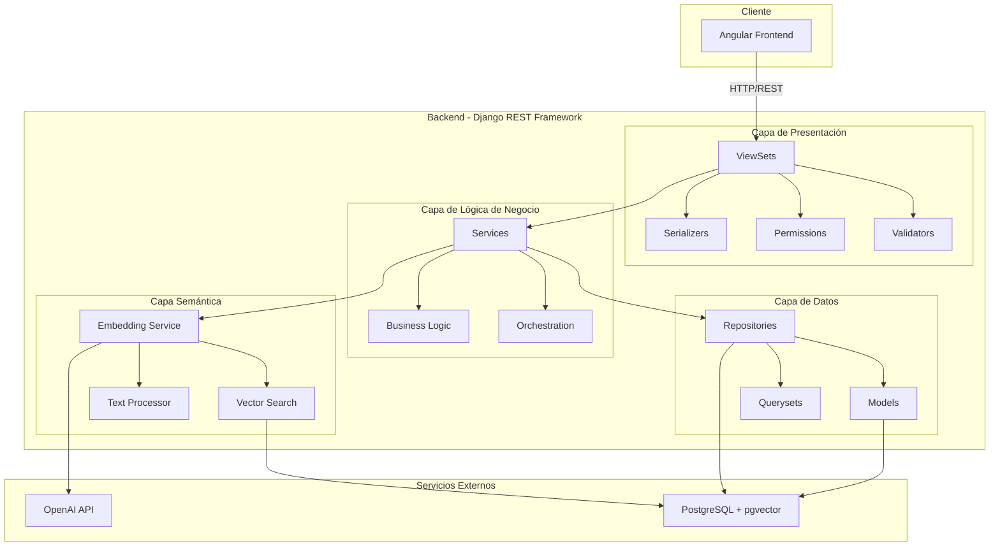

### 1.2 Diagrama ASCII Alternativo

```
┌─────────────────────────────────────────────────────────────────────┐
│                         CLIENTE (Angular)                           │
│                    HTTP/REST API Requests                          │
└──────────────────────────────┬──────────────────────────────────────┘
                               │
                               ▼
┌─────────────────────────────────────────────────────────────────────┐
│                    CAPA DE PRESENTACIÓN                              │
│  ┌──────────┐  ┌──────────┐  ┌──────────┐  ┌──────────┐          │
│  │ ViewSets │  │Serializers│  │Permissions│  │Validators│          │
│  └────┬─────┘  └────┬──────┘  └────┬──────┘  └────┬──────┘          │
│       │             │              │              │                 │
│       └─────────────┴──────────────┴──────────────┘                 │
└──────────────────────────────┬──────────────────────────────────────┘
                               │
                               ▼
┌─────────────────────────────────────────────────────────────────────┐
│                 CAPA DE LÓGICA DE NEGOCIO                             │
│  ┌──────────┐  ┌──────────┐  ┌──────────┐                          │
│  │ Services │  │Business  │  │Orchestr. │                          │
│  │          │  │Logic     │  │          │                          │
│  └────┬─────┘  └────┬─────┘  └────┬─────┘                          │
│       │             │              │                                 │
│       └─────────────┴──────────────┘                                 │
└──────────────┬───────────────────────────────┬──────────────────────┘
               │                               │
               ▼                               ▼
┌──────────────────────────┐    ┌──────────────────────────┐
│     CAPA DE DATOS        │    │   CAPA SEMÁNTICA         │
│  ┌──────────┐            │    │  ┌──────────┐            │
│  │Repository│            │    │  │Embedding │            │
│  └────┬─────┘            │    │  │Service  │            │
│       │                  │    │  └────┬─────┘            │
│  ┌────▼────┐             │    │       │                  │
│  │ Models  │             │    │  ┌────▼────┐             │
│  └────┬────┘             │    │  │Vector   │             │
│       │                  │    │  │Search   │             │
│  ┌────▼────┐             │    │  └────┬────┘             │
│  │Querysets│             │    │       │                  │
│  └────┬────┘             │    │  ┌────▼────┐             │
│       │                  │    │  │Text     │             │
│       └──────────────────┼────┼──┘Processor│             │
│                          │    │  └─────────┘             │
└──────────────────────────┼────┼──────────────────────────┘
                           │    │
                           ▼    ▼
                    ┌──────────────────┐
                    │   PostgreSQL     │
                    │   + pgvector     │
                    └──────────────────┘
                           │
                           ▼
                    ┌──────────────────┐
                    │   OpenAI API     │
                    └──────────────────┘
```

---

## 2. DIAGRAMA DE CAPAS DETALLADO

### 2.1 Estructura de Capas con Responsabilidades

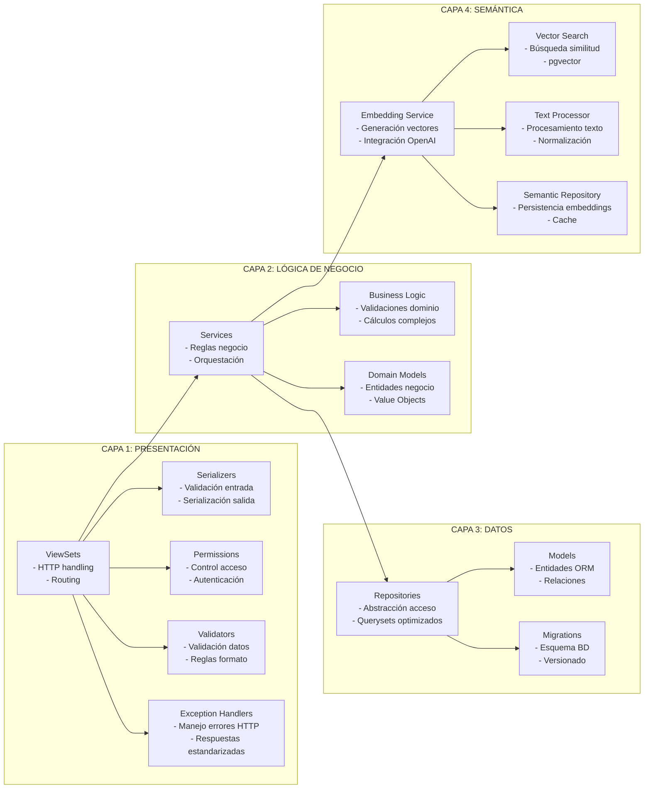

### 2.2 Reglas de Dependencia entre Capas

```
┌─────────────────────────────────────────────────────────────┐
│                    REGLAS DE DEPENDENCIA                    │
├─────────────────────────────────────────────────────────────┤
│                                                              │
│  PRESENTACIÓN ──► LÓGICA DE NEGOCIO ──► DATOS              │
│       │                    │                                 │
│       └────────────────────┼──► SEMÁNTICA                     │
│                           │                                 │
│  ✅ PRESENTACIÓN puede llamar a LÓGICA DE NEGOCIO           │
│  ✅ LÓGICA DE NEGOCIO puede llamar a DATOS y SEMÁNTICA     │
│  ❌ DATOS NO puede llamar a LÓGICA DE NEGOCIO               │
│  ❌ SEMÁNTICA NO puede llamar a LÓGICA DE NEGOCIO           │
│  ❌ PRESENTACIÓN NO puede llamar directamente a DATOS       │
│                                                              │
└─────────────────────────────────────────────────────────────┘
```

---

## 3. DIAGRAMA DE COMPONENTES POR APP

### 3.1 App: Usuarios

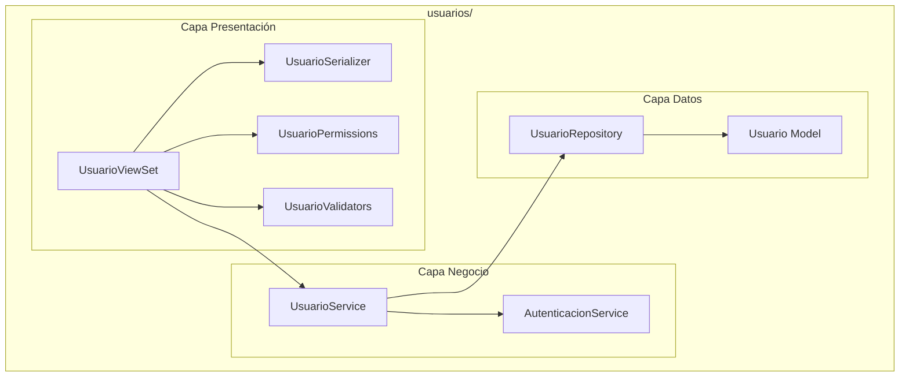

### 3.2 App: Archivos (Envíos)

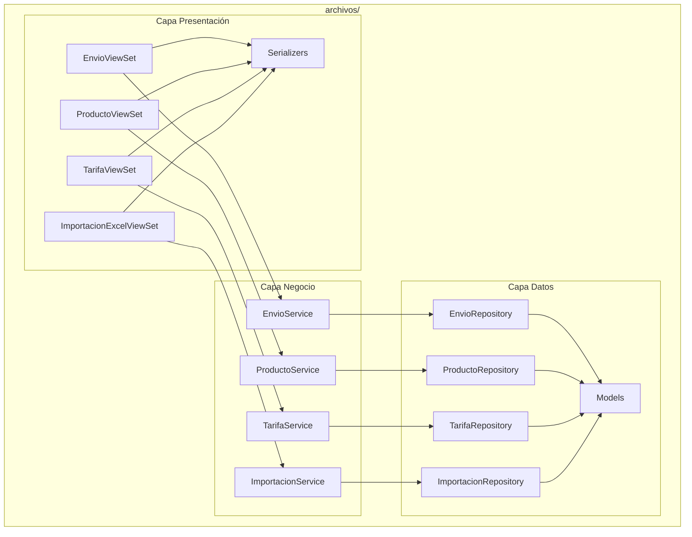

### 3.3 App: Búsqueda

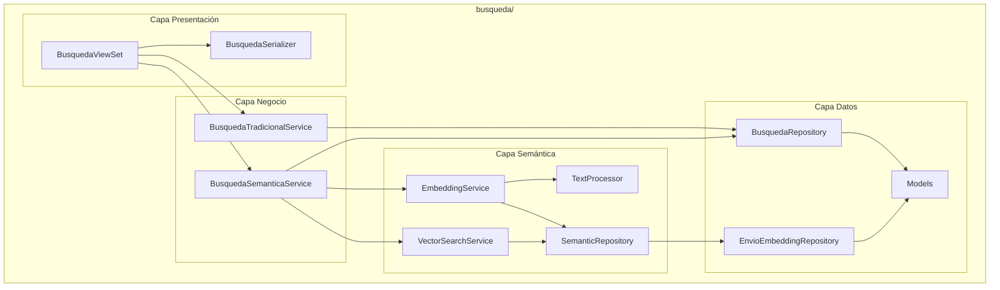

### 3.4 App: Notificaciones

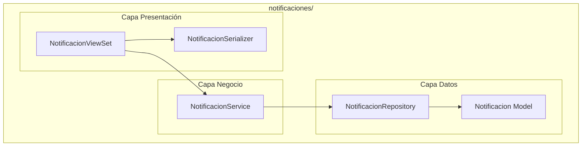

---

## 4. DIAGRAMA DE FLUJO DE DATOS

### 4.1 Flujo: Crear Envío

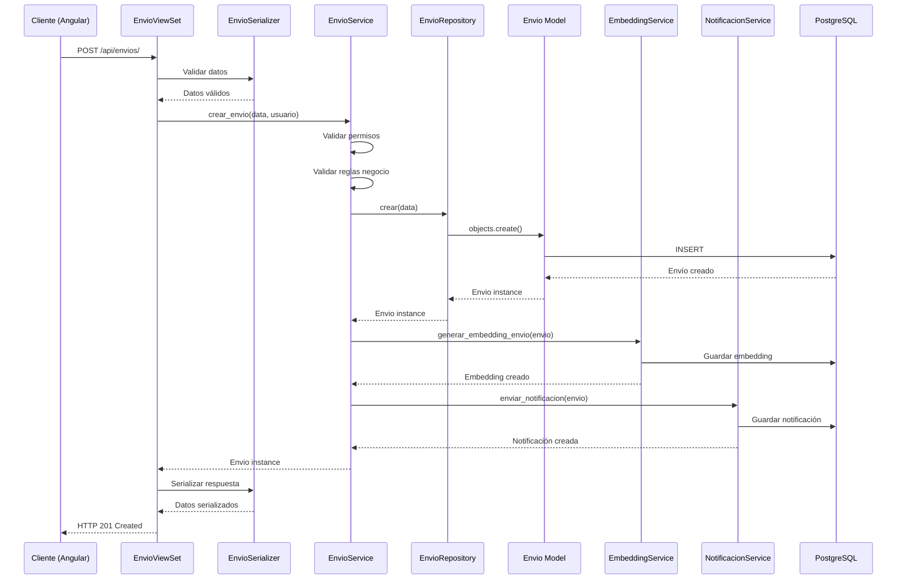

### 4.2 Flujo: Búsqueda Semántica

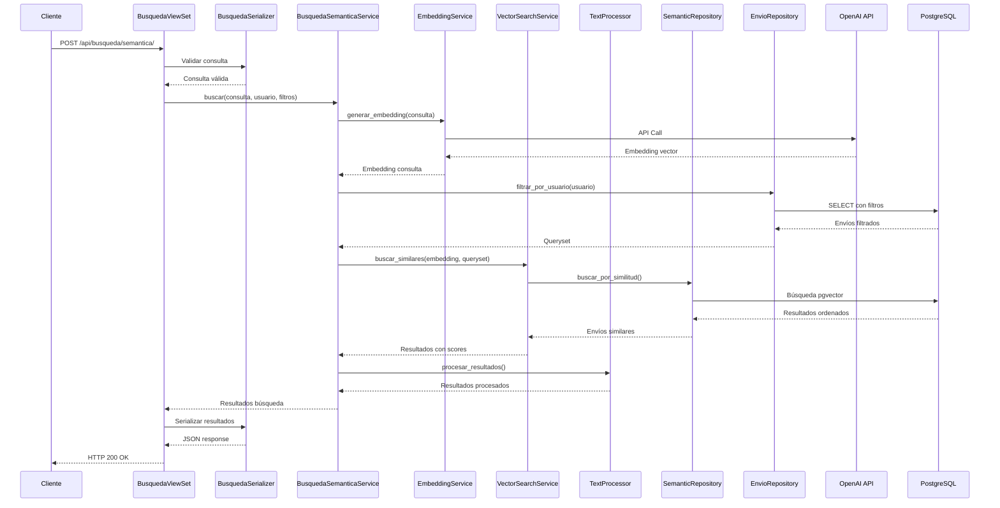

---

## 5. DIAGRAMA DE SECUENCIA - CASOS DE USO

### 5.1 Caso de Uso: Autenticación y Autorización

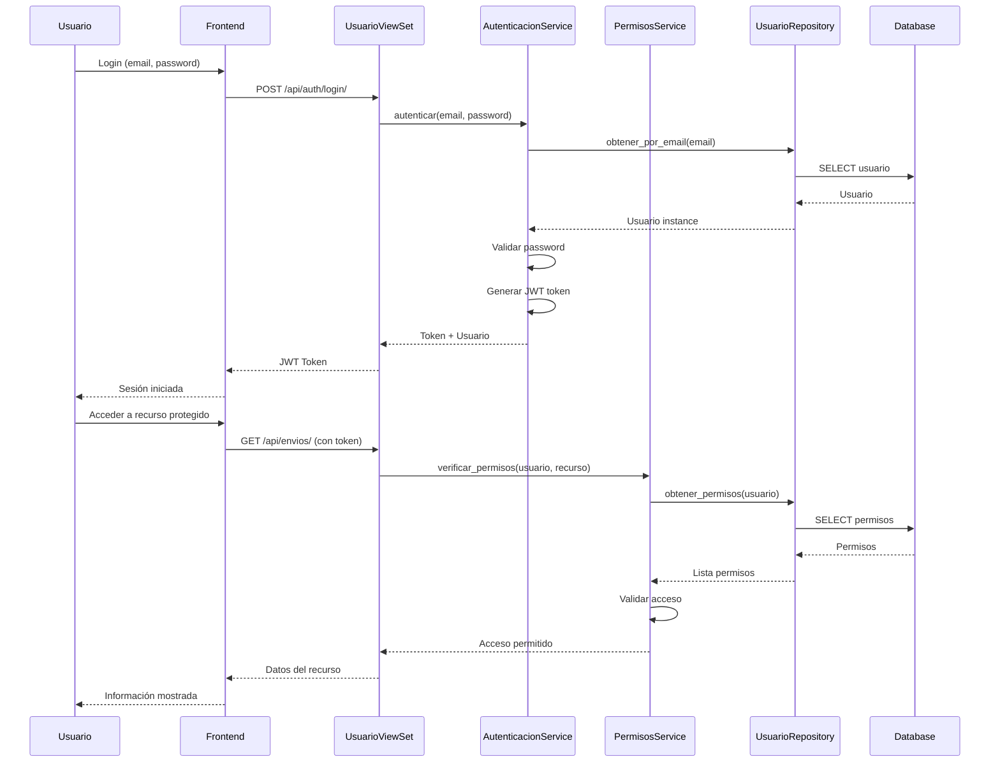

### 5.2 Caso de Uso: Importación Masiva Excel

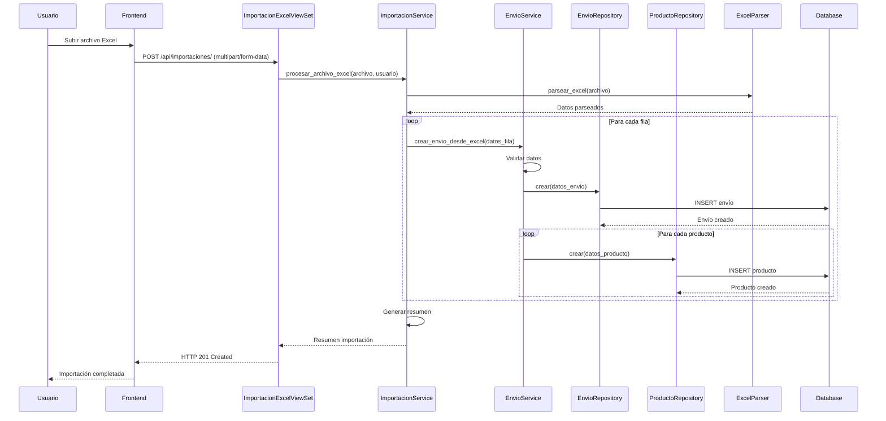

---

## 6. DIAGRAMA DE DEPENDENCIAS

### 6.1 Dependencias entre Módulos

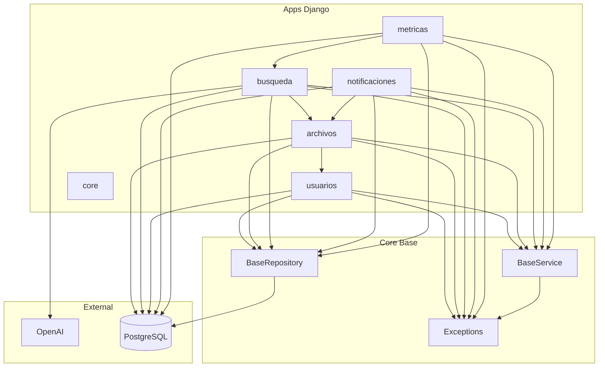

### 6.2 Matriz de Dependencias

| Módulo | Depende de | No debe depender de |
|--------|------------|---------------------|
| `usuarios` | `core.base`, `core.exceptions` | `archivos`, `busqueda` |
| `archivos` | `core.base`, `core.exceptions`, `usuarios` | `busqueda`, `notificaciones` |
| `busqueda` | `core.base`, `core.exceptions`, `archivos` | `notificaciones`, `metricas` |
| `notificaciones` | `core.base`, `core.exceptions`, `archivos` | `busqueda`, `usuarios` |
| `metricas` | `core.base`, `core.exceptions`, `busqueda` | `archivos`, `usuarios` |
| `core` | Ninguno | Todas las apps |

---

## 7. PROCESO DE IMPLEMENTACIÓN

### 7.1 Fase 1: Preparación y Análisis (Semana 1-2)

#### Paso 1.1: Auditoría del Código Actual

```bash
# Checklist de auditoría
□ Identificar todas las views que contienen lógica de negocio
□ Identificar código duplicado
□ Mapear dependencias actuales
□ Identificar querysets que necesitan optimización
□ Documentar reglas de negocio actuales
```

**Herramientas:**
- `grep -r "def " backend/apps/*/views.py` - Buscar métodos en views
- `grep -r "objects\." backend/apps/` - Buscar acceso directo a modelos
- `grep -r "class.*Service" backend/apps/` - Identificar servicios existentes

#### Paso 1.2: Crear Estructura de Carpetas

```bash
# Estructura a crear
backend/apps/
├── usuarios/
│   ├── services.py          # ✅ Ya existe
│   ├── repositories.py       # ✅ Ya existe
│   ├── business_logic.py     # ⭐ NUEVO (opcional)
│   └── querysets.py          # ⭐ NUEVO (opcional)
├── archivos/
│   ├── services.py          # ✅ Ya existe
│   ├── repositories.py      # ✅ Ya existe
│   └── business_logic.py    # ⭐ NUEVO
├── busqueda/
│   ├── services.py          # ✅ Ya existe
│   ├── repositories.py      # ✅ Ya existe
│   └── semantic/            # ✅ Ya existe
│       ├── embedding_service.py
│       ├── vector_search.py
│       └── text_processor.py
└── core/
    ├── base/                # ✅ Ya existe
    │   ├── base_service.py
    │   └── base_repository.py
    └── exceptions.py        # ✅ Ya existe
```

**Comando para crear estructura:**
```bash
# Crear archivos base si no existen
touch backend/apps/usuarios/business_logic.py
touch backend/apps/archivos/business_logic.py
touch backend/apps/usuarios/querysets.py
touch backend/apps/archivos/querysets.py
```

#### Paso 1.3: Definir Interfaces Base

Crear interfaces/clases base para garantizar consistencia:

```python
# backend/apps/core/base/base_service.py (mejorar si existe)
from abc import ABC, abstractmethod

class BaseService(ABC):
    """Clase base para todos los servicios"""
    
    @classmethod
    @abstractmethod
    def validate_permissions(cls, usuario, action):
        """Validar permisos del usuario"""
        pass
    
    @classmethod
    @abstractmethod
    def validate_business_rules(cls, data):
        """Validar reglas de negocio"""
        pass
```

---

### 7.2 Fase 2: Refactorización de Capa de Datos (Semana 3-4)

#### Paso 2.1: Crear/Mejorar Repositorios

**Objetivo:** Encapsular todo el acceso a datos

**Proceso:**

1. **Identificar accesos directos a modelos:**
```bash
# Buscar accesos directos
grep -r "\.objects\." backend/apps/*/views.py
grep -r "\.objects\." backend/apps/*/services.py
```

2. **Crear métodos en repositorios:**
```python
# Ejemplo: apps/archivos/repositories.py
class EnvioRepository(BaseRepository):
    @staticmethod
    def obtener_por_id(envio_id: int) -> Envio:
        """Obtiene un envío por ID con relaciones optimizadas"""
        return Envio.objects.select_related(
            'comprador',
            'digitador'
        ).prefetch_related(
            'productos',
            'productos__categoria'
        ).get(id=envio_id)
    
    @staticmethod
    def filtrar_por_usuario(usuario: Usuario):
        """Filtra envíos según permisos del usuario"""
        queryset = Envio.objects.select_related('comprador')
        
        if usuario.es_comprador:
            return queryset.filter(comprador=usuario)
        elif usuario.es_digitador:
            return queryset.filter(digitador=usuario)
        elif usuario.es_gerente:
            return queryset.all()  # Gerente ve todos
        else:
            return queryset.none()
```

3. **Migrar código existente:**
   - Reemplazar `Modelo.objects.get()` por `Repository.obtener_por_id()`
   - Reemplazar `Modelo.objects.filter()` por métodos del repositorio
   - Agregar `select_related()` y `prefetch_related()` donde sea necesario

**Checklist:**
- [ ] Todos los repositorios heredan de `BaseRepository`
- [ ] No hay acceso directo a `.objects` fuera de repositorios
- [ ] Todas las consultas usan `select_related`/`prefetch_related`
- [ ] Excepciones de dominio creadas (ej: `EnvioNoEncontrado`)

---

#### Paso 2.2: Optimizar Querysets

**Objetivo:** Eliminar queries N+1

**Proceso:**

1. **Identificar problemas N+1:**
```python
# ❌ MAL - N+1 queries
for envio in Envio.objects.all():
    print(envio.comprador.nombre)  # Query por cada iteración

# ✅ BIEN - 1 query con select_related
for envio in Envio.objects.select_related('comprador').all():
    print(envio.comprador.nombre)  # Sin queries adicionales
```

2. **Crear querysets personalizados:**
```python
# apps/archivos/querysets.py
class EnvioQuerySet(models.QuerySet):
    def con_relaciones(self):
        """Queryset optimizado con todas las relaciones"""
        return self.select_related(
            'comprador',
            'digitador'
        ).prefetch_related(
            'productos',
            'productos__categoria'
        )
    
    def por_estado(self, estado: str):
        """Filtra por estado"""
        return self.filter(estado=estado)
    
    def por_fecha_rango(self, fecha_desde, fecha_hasta):
        """Filtra por rango de fechas"""
        return self.filter(
            fecha_emision__gte=fecha_desde,
            fecha_emision__lte=fecha_hasta
        )

# En models.py
class Envio(models.Model):
    # ... campos ...
    objects = EnvioQuerySet.as_manager()
```

**Checklist:**
- [ ] No hay queries N+1 en el código
- [ ] Querysets personalizados creados donde sea necesario
- [ ] Uso de `select_related` para ForeignKey
- [ ] Uso de `prefetch_related` para ManyToMany y Reverse ForeignKey

---

### 7.3 Fase 3: Refactorización de Capa de Negocio (Semana 5-6)

#### Paso 3.1: Extraer Lógica de Negocio de Views

**Objetivo:** Views solo manejan HTTP, toda la lógica va a servicios

**Proceso:**

1. **Identificar lógica en views:**
```python
# ❌ ANTES - Lógica en view
class EnvioViewSet(viewsets.ModelViewSet):
    def create(self, request):
        # ⚠️ 50+ líneas de lógica de negocio
        if not request.user.puede_crear_envio():
            return Response(...)
        # Validaciones...
        # Cálculos...
        # Operaciones...
        return Response(...)

# ✅ DESPUÉS - Lógica en servicio
class EnvioViewSet(viewsets.ModelViewSet):
    def create(self, request):
        serializer = self.get_serializer(data=request.data)
        serializer.is_valid(raise_exception=True)
        
        # Delegar a servicio
        envio = EnvioService.crear_envio(
            data=serializer.validated_data,
            usuario=request.user
        )
        
        return Response(
            EnvioSerializer(envio).data,
            status=status.HTTP_201_CREATED
        )
```

2. **Crear servicios con reglas de negocio:**
```python
# apps/archivos/services.py
class EnvioService(BaseService):
    @classmethod
    def crear_envio(cls, data: dict, usuario: Usuario) -> Envio:
        """
        Crea un envío aplicando todas las reglas de negocio
        """
        # 1. Validar permisos
        cls.validate_permissions(usuario, 'crear_envio')
        
        # 2. Validar reglas de negocio
        cls.validate_business_rules(data, usuario)
        
        # 3. Preparar datos
        datos_envio = cls._preparar_datos_envio(data, usuario)
        
        # 4. Crear envío
        envio = EnvioRepository.crear(datos_envio)
        
        # 5. Operaciones post-creación
        cls._post_creacion(envio, data)
        
        return envio
    
    @classmethod
    def _preparar_datos_envio(cls, data: dict, usuario: Usuario) -> dict:
        """Prepara datos del envío antes de crear"""
        datos = data.copy()
        datos['digitador'] = usuario
        datos['fecha_emision'] = timezone.now()
        # Cálculos adicionales...
        return datos
    
    @classmethod
    def _post_creacion(cls, envio: Envio, data: dict):
        """Operaciones después de crear el envío"""
        # Generar embedding
        EmbeddingService.generar_embedding_envio(envio)
        
        # Enviar notificación
        NotificacionService.enviar_notificacion_creacion(envio)
        
        # Registrar métricas
        MetricaService.registrar_creacion_envio(envio)
```

**Checklist:**
- [ ] No hay lógica de negocio en views
- [ ] Todos los servicios heredan de `BaseService`
- [ ] Reglas de negocio documentadas en servicios
- [ ] Validaciones centralizadas

---

#### Paso 3.2: Implementar Patrón Unit of Work

**Objetivo:** Garantizar transacciones atómicas

```python
# apps/archivos/services.py
from django.db import transaction

class EnvioService(BaseService):
    @classmethod
    @transaction.atomic
    def crear_envio_completo(cls, data: dict, usuario: Usuario) -> Envio:
        """
        Crea envío con productos en una transacción atómica
        """
        # Crear envío
        envio = EnvioRepository.crear(data['envio'])
        
        # Crear productos
        productos = []
        for producto_data in data['productos']:
            producto = ProductoRepository.crear({
                **producto_data,
                'envio': envio
            })
            productos.append(producto)
        
        # Calcular totales
        envio.peso_total = sum(p.peso for p in productos)
        envio.costo_total = sum(p.costo_envio for p in productos)
        EnvioRepository.actualizar(envio, {
            'peso_total': envio.peso_total,
            'costo_total': envio.costo_total
        })
        
        return envio
```

---

### 7.4 Fase 4: Refactorización de Capa Semántica (Semana 7-8)

#### Paso 4.1: Reorganizar Código de Embeddings

**Objetivo:** Centralizar y organizar lógica semántica

**Proceso:**

1. **Mover código a estructura semántica:**
```bash
# Si existe utils_embeddings.py, mover funciones a:
# - apps/busqueda/semantic/embedding_service.py
# - apps/busqueda/semantic/text_processor.py
# - apps/busqueda/semantic/vector_search.py
```

2. **Crear servicio de embeddings unificado:**
```python
# apps/busqueda/semantic/embedding_service.py
class EmbeddingService(BaseService):
    _client = None
    
    @classmethod
    def get_client(cls):
        """Singleton para cliente OpenAI"""
        if cls._client is None:
            cls._client = OpenAI(api_key=settings.OPENAI_API_KEY)
        return cls._client
    
    @classmethod
    def generar_embedding(cls, texto: str, modelo: str = 'text-embedding-3-small') -> dict:
        """Genera embedding de un texto"""
        client = cls.get_client()
        response = client.embeddings.create(
            input=texto,
            model=modelo
        )
        return {
            'embedding': response.data[0].embedding,
            'tokens': response.usage.total_tokens,
            'modelo': modelo
        }
    
    @classmethod
    def generar_embedding_envio(cls, envio: Envio) -> EnvioEmbedding:
        """Genera embedding para un envío completo"""
        texto = TextProcessor.generar_texto_envio(envio)
        resultado = cls.generar_embedding(texto)
        
        return SemanticRepository.guardar_embedding(
            envio=envio,
            embedding=resultado['embedding'],
            texto_indexado=texto,
            modelo=resultado['modelo']
        )
```

3. **Optimizar búsqueda vectorial:**
```python
# apps/busqueda/semantic/vector_search.py
class VectorSearchService(BaseService):
    @classmethod
    def buscar_similares(
        cls,
        embedding_consulta: List[float],
        queryset_base: QuerySet,
        limite: int = 20,
        umbral: float = 0.35
    ) -> List[dict]:
        """
        Busca envíos similares usando pgvector
        """
        # Obtener IDs de envíos del queryset base
        envio_ids = list(queryset_base.values_list('id', flat=True))
        
        # Búsqueda vectorial nativa con pgvector
        resultados = EnvioEmbedding.objects.filter(
            envio_id__in=envio_ids
        ).annotate(
            similitud=1 - CosineDistance('embedding_vector', embedding_consulta)
        ).filter(
            similitud__gte=umbral
        ).order_by('-similitud')[:limite].select_related(
            'envio',
            'envio__comprador'
        ).prefetch_related(
            'envio__productos'
        )
        
        return [
            {
                'envio': resultado.envio,
                'similitud': float(resultado.similitud),
                'texto_indexado': resultado.texto_indexado
            }
            for resultado in resultados
        ]
```

**Checklist:**
- [ ] Todo el código de embeddings está en `semantic/`
- [ ] No hay duplicación de código de embeddings
- [ ] Cliente OpenAI es singleton
- [ ] Búsqueda vectorial usa pgvector nativo

---

### 7.5 Fase 5: Refactorización de Capa de Presentación (Semana 9-10)

#### Paso 5.1: Simplificar Views

**Objetivo:** Views solo manejan HTTP

**Proceso:**

1. **Simplificar cada view:**
```python
# ✅ View simplificada
class EnvioViewSet(viewsets.ModelViewSet):
    serializer_class = EnvioSerializer
    permission_classes = [IsAuthenticated, EnvioPermission]
    
    def get_queryset(self):
        """Obtiene queryset según permisos"""
        return EnvioRepository.filtrar_por_usuario(self.request.user)
    
    def create(self, request, *args, **kwargs):
        """Crea un envío"""
        serializer = self.get_serializer(data=request.data)
        serializer.is_valid(raise_exception=True)
        
        envio = EnvioService.crear_envio(
            data=serializer.validated_data,
            usuario=request.user
        )
        
        return Response(
            EnvioSerializer(envio).data,
            status=status.HTTP_201_CREATED
        )
    
    def update(self, request, *args, **kwargs):
        """Actualiza un envío"""
        instance = self.get_object()
        serializer = self.get_serializer(instance, data=request.data)
        serializer.is_valid(raise_exception=True)
        
        envio = EnvioService.actualizar_envio(
            envio=instance,
            data=serializer.validated_data,
            usuario=request.user
        )
        
        return Response(EnvioSerializer(envio).data)
```

2. **Mejorar serializers:**
```python
# apps/archivos/serializers.py
class EnvioSerializer(serializers.ModelSerializer):
    comprador_nombre = serializers.CharField(source='comprador.nombre', read_only=True)
    productos = ProductoSerializer(many=True, read_only=True)
    
    class Meta:
        model = Envio
        fields = [
            'id', 'hawb', 'comprador', 'comprador_nombre',
            'fecha_emision', 'estado', 'productos', ...
        ]
        read_only_fields = ['id', 'fecha_emision']
    
    def validate(self, data):
        """Validaciones adicionales"""
        # Validaciones de formato
        return data
```

**Checklist:**
- [ ] Views tienen menos de 50 líneas cada una
- [ ] No hay lógica de negocio en views
- [ ] Serializers manejan validación de formato
- [ ] Permisos centralizados

---

#### Paso 5.2: Centralizar Manejo de Errores

**Objetivo:** Respuestas de error consistentes

```python
# apps/core/exceptions.py
from rest_framework.views import exception_handler
from rest_framework.response import Response
from rest_framework import status

def custom_exception_handler(exc, context):
    """
    Manejo centralizado de excepciones
    """
    # Llamar al handler por defecto
    response = exception_handler(exc, context)
    
    if response is not None:
        # Personalizar respuesta
        custom_response_data = {
            'error': {
                'code': response.status_code,
                'message': str(exc),
                'details': response.data if isinstance(response.data, dict) else {}
            }
        }
        response.data = custom_response_data
    
    return response

# settings.py
REST_FRAMEWORK = {
    'EXCEPTION_HANDLER': 'apps.core.exceptions.custom_exception_handler',
    # ... otras configuraciones
}
```

---

### 7.6 Fase 6: Testing y Documentación (Semana 11-12)

#### Paso 6.1: Tests Unitarios

**Objetivo:** Cobertura >80%

```python
# apps/archivos/tests/test_services.py
from django.test import TestCase
from apps.archivos.services import EnvioService
from apps.archivos.repositories import EnvioRepository
from apps.usuarios.models import Usuario

class EnvioServiceTestCase(TestCase):
    def setUp(self):
        self.usuario = Usuario.objects.create_user(...)
        self.envio_data = {...}
    
    def test_crear_envio_exitoso(self):
        """Test crear envío con datos válidos"""
        envio = EnvioService.crear_envio(
            data=self.envio_data,
            usuario=self.usuario
        )
        
        self.assertIsNotNone(envio)
        self.assertEqual(envio.digitador, self.usuario)
    
    def test_crear_envio_sin_permisos(self):
        """Test que no se puede crear envío sin permisos"""
        usuario_sin_permisos = Usuario.objects.create_user(...)
        
        with self.assertRaises(PermissionDenied):
            EnvioService.crear_envio(
                data=self.envio_data,
                usuario=usuario_sin_permisos
            )
```

**Checklist:**
- [ ] Tests unitarios para todos los servicios
- [ ] Tests unitarios para repositorios
- [ ] Tests de integración para flujos completos
- [ ] Cobertura >80%

---

#### Paso 6.2: Documentación

**Objetivo:** Documentar arquitectura y uso

1. **Documentar servicios:**
```python
# apps/archivos/services.py
class EnvioService(BaseService):
    """
    Servicio para gestión de envíos
    
    Responsabilidades:
    - Crear, actualizar, eliminar envíos
    - Validar reglas de negocio
    - Orquestar operaciones relacionadas
    
    Reglas de Negocio:
    - Solo digitadores y admins pueden crear envíos
    - Compradores solo pueden ver sus envíos
    - No se puede eliminar envío con estado "Entregado"
    """
    # ... código ...
```

2. **Crear guía de uso:**
```markdown
# GUIA_USO_SERVICIOS.md
## Cómo usar EnvioService

### Crear un envío
```python
from apps.archivos.services import EnvioService

envio = EnvioService.crear_envio(
    data={
        'hawb': 'HAW12345',
        'comprador_id': 1,
        # ... más datos
    },
    usuario=request.user
)
```
```

**Checklist:**
- [ ] Docstrings en todos los servicios
- [ ] Docstrings en todos los repositorios
- [ ] Guía de uso creada
- [ ] Diagramas actualizados

---

## 8. CHECKLIST DE VERIFICACIÓN

### 8.1 Checklist por Capa

#### ✅ Capa de Presentación
- [ ] Views tienen menos de 50 líneas
- [ ] No hay lógica de negocio en views
- [ ] Serializers validan formato de datos
- [ ] Permisos centralizados y reutilizables
- [ ] Manejo de errores centralizado
- [ ] Validaciones de entrada en serializers

#### ✅ Capa de Lógica de Negocio
- [ ] Todos los servicios heredan de `BaseService`
- [ ] Reglas de negocio documentadas
- [ ] Validaciones de permisos centralizadas
- [ ] Transacciones atómicas donde sea necesario
- [ ] No hay dependencias de HTTP en servicios
- [ ] Servicios son testeables independientemente

#### ✅ Capa de Datos
- [ ] Todos los repositorios heredan de `BaseRepository`
- [ ] No hay acceso directo a `.objects` fuera de repositorios
- [ ] Querysets optimizados (select_related, prefetch_related)
- [ ] No hay queries N+1
- [ ] Excepciones de dominio definidas
- [ ] Migraciones versionadas

#### ✅ Capa Semántica
- [ ] Código de embeddings centralizado
- [ ] Cliente OpenAI es singleton
- [ ] Búsqueda vectorial optimizada
- [ ] Text processor reutilizable
- [ ] Cache de embeddings implementado (opcional)

### 8.2 Checklist General

#### ✅ Código
- [ ] No hay duplicación de código
- [ ] Principios SOLID aplicados
- [ ] Patrones de diseño implementados correctamente
- [ ] Código documentado

#### ✅ Testing
- [ ] Cobertura de tests >80%
- [ ] Tests unitarios para servicios
- [ ] Tests de integración para flujos
- [ ] Tests de performance para búsqueda semántica

#### ✅ Documentación
- [ ] Arquitectura documentada
- [ ] Guías de uso creadas
- [ ] Diagramas actualizados
- [ ] README actualizado

---

## 9. HERRAMIENTAS Y COMANDOS ÚTILES

### 9.1 Comandos de Análisis

```bash
# Buscar lógica de negocio en views
grep -r "if.*usuario\|if.*permiso\|if.*validar" backend/apps/*/views.py

# Buscar acceso directo a modelos
grep -r "\.objects\." backend/apps/*/views.py
grep -r "\.objects\." backend/apps/*/services.py

# Buscar código duplicado (requiere herramienta externa)
# Usar: pylint, sonarqube, o similar

# Analizar complejidad ciclomática
radon cc backend/apps/*/views.py
radon cc backend/apps/*/services.py
```

### 9.2 Comandos de Testing

```bash
# Ejecutar tests
python manage.py test

# Ejecutar tests con cobertura
coverage run --source='.' manage.py test
coverage report
coverage html  # Genera reporte HTML

# Ejecutar tests específicos
python manage.py test apps.archivos.tests.test_services
```

### 9.3 Comandos de Migración

```bash
# Crear migraciones
python manage.py makemigrations

# Aplicar migraciones
python manage.py migrate

# Ver estado de migraciones
python manage.py showmigrations
```

---

## 10. MÉTRICAS DE ÉXITO

### 10.1 Métricas de Código

| Métrica | Objetivo | Cómo Medir |
|---------|----------|------------|
| Líneas en views | <50 por método | `wc -l backend/apps/*/views.py` |
| Cobertura de tests | >80% | `coverage report` |
| Complejidad ciclomática | <10 por método | `radon cc` |
| Duplicación de código | <5% | Herramientas de análisis estático |

### 10.2 Métricas de Performance

| Métrica | Objetivo | Cómo Medir |
|---------|----------|------------|
| Queries N+1 | 0 | Django Debug Toolbar |
| Tiempo respuesta búsqueda semántica | <500ms | Tests de performance |
| Tiempo respuesta API promedio | <200ms | APM tools |

### 10.3 Métricas de Mantenibilidad

| Métrica | Objetivo | Cómo Medir |
|---------|----------|------------|
| Tiempo para agregar funcionalidad | -30% | Tracking de tareas |
| Tiempo para entender código | -40% | Code review time |

---

## 11. CONCLUSIÓN

Este documento proporciona:

1. ✅ **Diagramas completos** de la arquitectura propuesta
2. ✅ **Proceso paso a paso** para implementar la arquitectura
3. ✅ **Checklist de verificación** para cada fase
4. ✅ **Herramientas y comandos** útiles
5. ✅ **Métricas de éxito** para medir el progreso

**Próximos Pasos:**
1. Revisar y aprobar este documento
2. Crear issues/tareas para cada fase
3. Comenzar con Fase 1 (Preparación)
4. Realizar code reviews en cada fase
5. Medir métricas de éxito continuamente

---

**Documento creado:** Enero 2025  
**Última actualización:** Enero 2025  
**Versión:** 2.0

