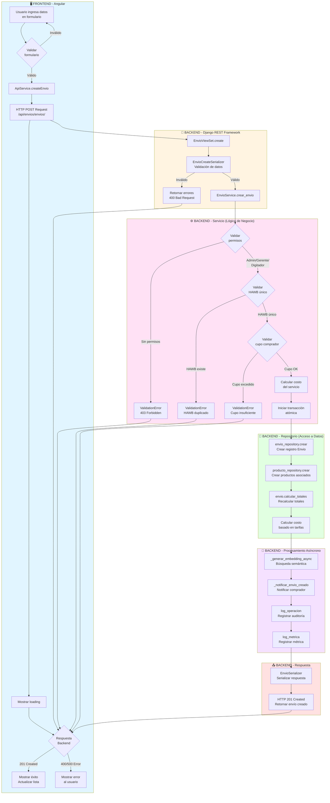
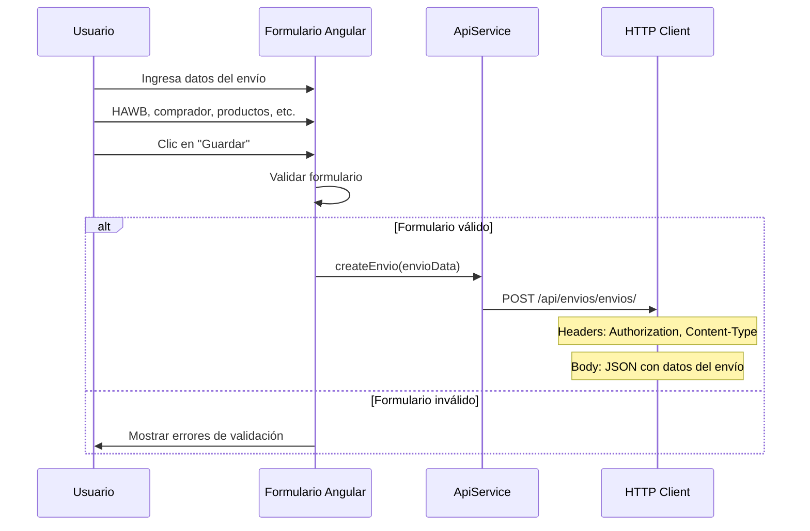
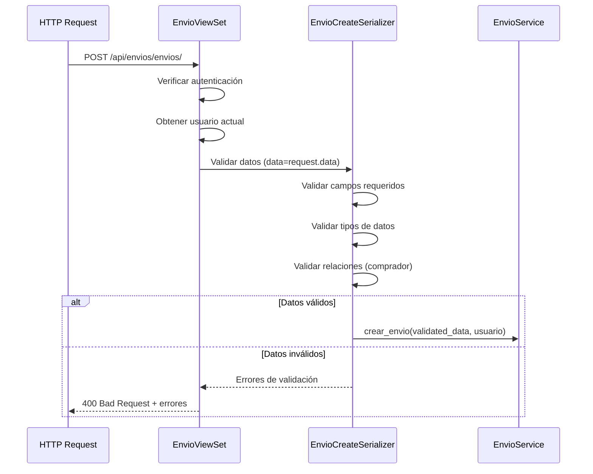
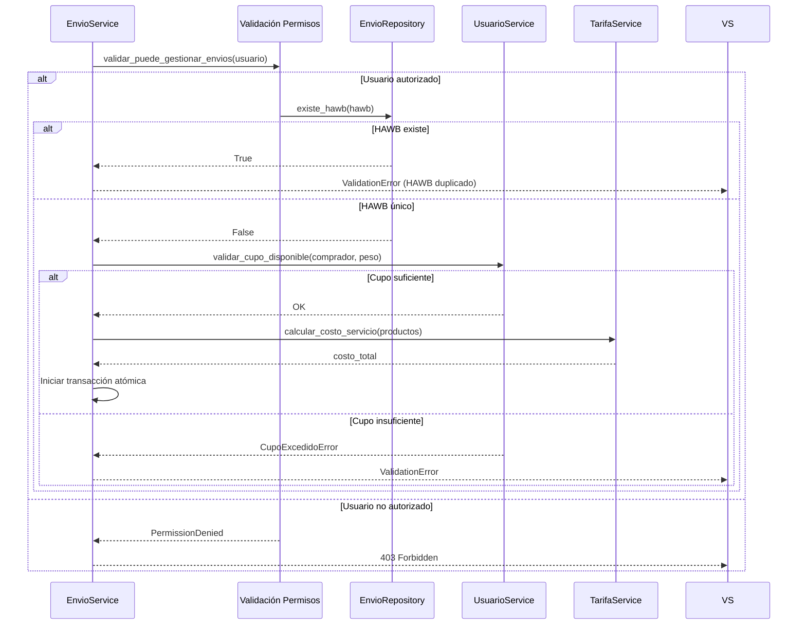
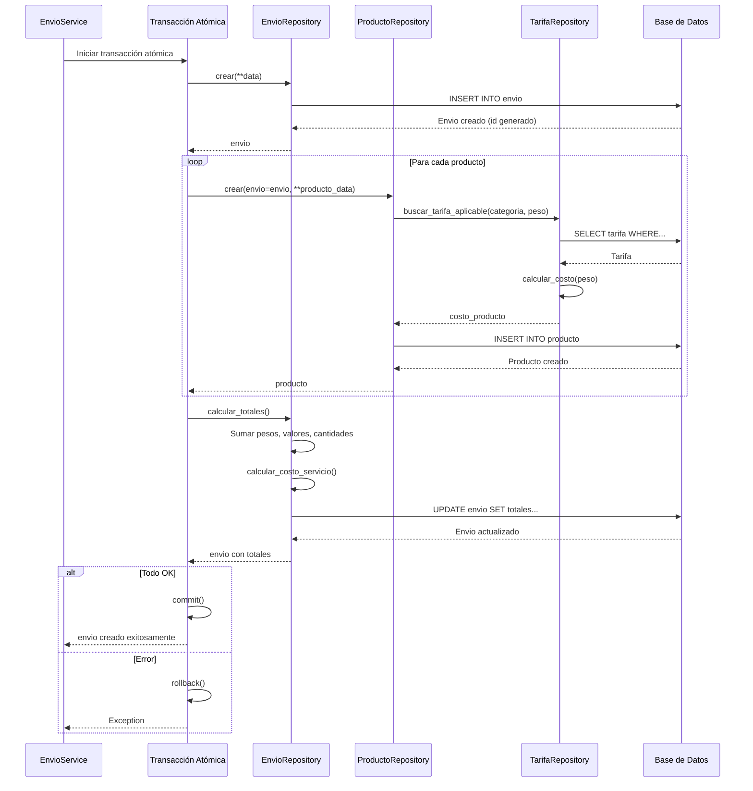
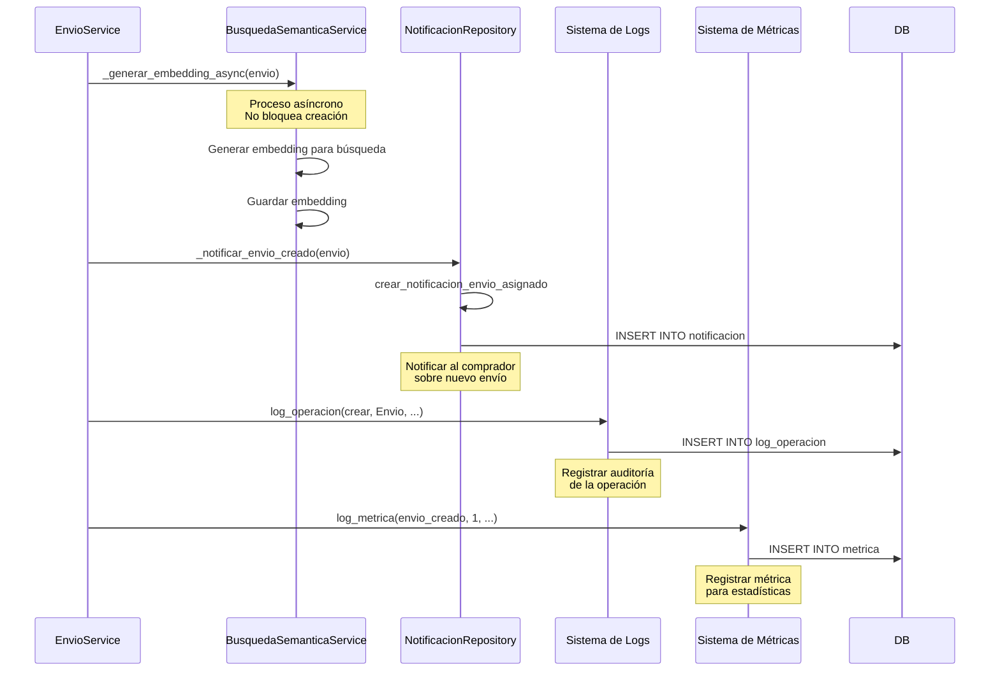
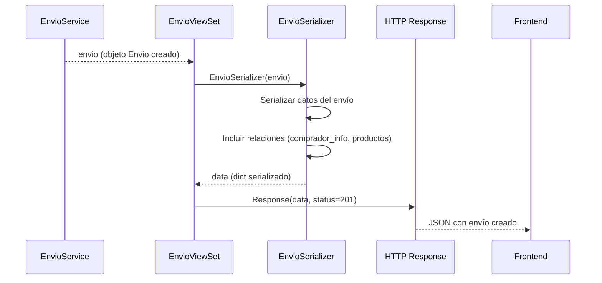

# Diagrama del Proceso de Registro de Envío

## 📊 Diagrama Completo del Flujo

## 🔄 Flujo Detallado Paso a Paso

### 1. FRONTEND - Captura de Datos

### 2. BACKEND - Recepción y Validación Inicial

### 3. BACKEND - Lógica de Negocio

### 4. BACKEND - Creación en Base de Datos

### 5. BACKEND - Procesamiento Asíncrono

### 6. BACKEND - Respuesta al Frontend

## 📋 Resumen del Flujo Completo

### Tiempos Estimados por Etapa

| Etapa | Componente | Tiempo Estimado | Tipo |
|-------|-----------|-----------------|------|
| 1. Validación Frontend | Angular Form | 0.01-0.05s | Síncrono |
| 2. Request HTTP | Network | 0.05-0.2s | Síncrono |
| 3. Validación Serializer | Django REST | 0.01-0.05s | Síncrono |
| 4. Validación Permisos | Service | 0.001-0.01s | Síncrono |
| 5. Validación HAWB | Repository | 0.01-0.05s | Síncrono |
| 6. Validación Cupo | Service | 0.01-0.05s | Síncrono |
| 7. Cálculo Costo | TarifaService | 0.01-0.1s | Síncrono |
| 8. Creación Envío | Repository | 0.02-0.1s | Síncrono |
| 9. Creación Productos | Repository | 0.05-0.2s | Síncrono |
| 10. Cálculo Totales | Model Method | 0.01-0.1s | Síncrono |
| 11. Generación Embedding | Async Service | 0.1-1.0s | Asíncrono |
| 12. Notificación | Async Service | 0.05-0.2s | Asíncrono |
| 13. Logs y Métricas | Log Service | 0.01-0.05s | Asíncrono |
| 14. Serialización Respuesta | Serializer | 0.01-0.05s | Síncrono |
| **TOTAL (Síncrono)** | | **0.2-0.8s** | |
| **TOTAL (Incluyendo Async)** | | **0.3-1.0s** | |

### Puntos de Validación

1. ✅ **Frontend**: Validación de formulario (campos requeridos, tipos)
2. ✅ **Serializer**: Validación de estructura y tipos de datos
3. ✅ **Permisos**: Solo Admin/Gerente/Digitador pueden crear
4. ✅ **HAWB**: Debe ser único en el sistema
5. ✅ **Cupo**: Comprador debe tener cupo disponible
6. ✅ **Comprador**: Debe ser rol Comprador (4)
7. ✅ **Productos**: Cada producto debe tener datos válidos
8. ✅ **Tarifas**: Debe existir tarifa aplicable para cada producto

### Puntos de Error

1. ❌ **400 Bad Request**: Datos inválidos en formulario
2. ❌ **400 Bad Request**: HAWB duplicado
3. ❌ **400 Bad Request**: Cupo insuficiente
4. ❌ **403 Forbidden**: Usuario sin permisos
5. ❌ **404 Not Found**: Comprador no encontrado
6. ❌ **500 Internal Server Error**: Error en base de datos o proceso

### Transacciones Atómicas

- ✅ Toda la creación del envío y productos está dentro de una transacción
- ✅ Si falla cualquier paso, se hace rollback completo
- ✅ Garantiza consistencia de datos

### Procesos Asíncronos

- 🔄 Generación de embedding (no bloquea)
- 🔄 Notificaciones al comprador (no bloquea)
- 🔄 Logs de auditoría (no bloquea)
- 🔄 Métricas (no bloquea)
